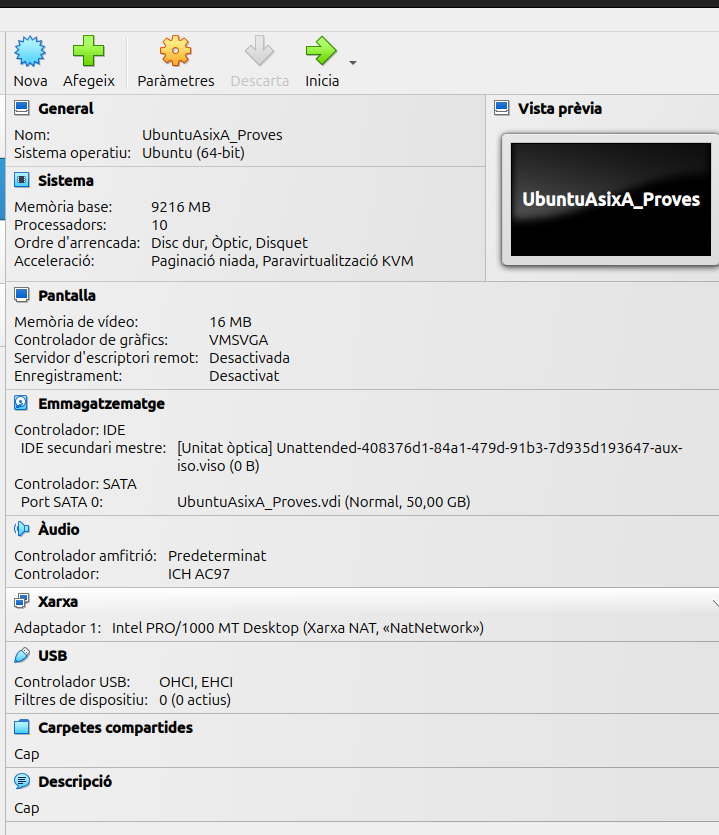
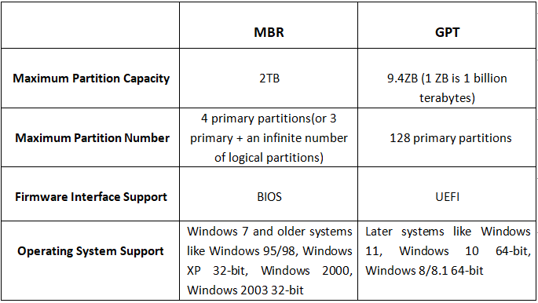

# Sprint 1

Aqui se documentara toda la informacion necesaria sobre el **Sprint 1**.

## Instalacion del sistema operativo
En estas capturas se mostrara las partes importantes a tener en cuenta a la hora de instalar un sistema operativo.

### Configuración 
En esta captura se puede apreciar la **configuración que se le a dado a la Maquina Virtual y la ISO añadida**.

#### Particiones

En este apartado veremos como se pueden crear las particiones en la instalación del **Ubuntu** una vez esta configurada en el ***VirtualBox***.

.png)

Aqui vemos el espacio que se le asigna a una de als particiones dandole a "Nueva Partición" sobre "Espacio Libre", asi podremos crear tantas particiones como queramos.

Finalmente se crean las particiones necesarias y asi quedaria.

### Red
En esta captura se muestra la **RED** que se le añade a la Maquina Virtual, en este caso se le pone el tipo de red ***Xarxa NAT***.

***Xarxa Nat:***

"*Una red NAT es una red que creará VirtualBox que permite compartir dicha red con varias máquinas virtuales de este sistema anfitrión. Además, VirtualBox en este tipo de red va a proporcionar una puerta de enlace con salida a Internet en la dirección de host número 1 de la red. Además, VirtualBox proporcionará un servidor DHCP para dicha red de forma que los equipos conectados a la red pueden obtener automáticamente información de configuración de red.*"

## Licenciamiento

***Ubuntu es un programa libre***

Datos sobre la licencia de un programa libre:

> - Para que un programa sea libre se tiene que poder utilizar sin condiciones

> - Se tiene que poder estudiar y adaptarlo a las condiciones

> - Se tiene que poder tener acceso abierto al codigo

> - Se tiene que poder distribuir

> - Se tiene que poder mejorar y se podran distribuir las modificaciones.
        
## Puntos de restauracion

## Configuracion básica de la red

Nos introducimos dentro de la carpeta ***"/etc/netplan"*** y modificamos el archivo de Red añadiendo la configuracion que nosotros queramos para nuestra red

Para que esta configuracion se guarde tendremos que utilizar el comando ***"netplan apply"***

Al realizar ***"ip a"*** veremos que la configuracion editada en el anterior archivo se a verificado y aplicado correctamente.

## Instalacion de aplicacions

### Comandos basicos a tener en cuenta:
Comandos para actualizar:

> - apt update -> actualitza llista de tos els paquets mirant el fitxer /etc/apt/sources.list
> - apt upgrade -> actualitza el sistema, instal·lant noves versions en cas que existeixin, però NO
instal·la nous paquets
> - apt dist-upgrade -> igual que l'aneterior, però també instal·larà nous paquets en cas que existeixin

Comandos para eliminar:

> - apt remove paquet -> esborra paquet
> - apt purge paquet -> esborra paquet i configuracions
> - apt autoremove -> esborra paquets del SO que ja no s'utilitzen
> - apt clean -> esborra paquets descarregats

DPKG:
> - dpkg -r paquet
> - dpkg -P paquet
> - dpkg -i arxiu.deb
> - dpkg -s paquet -> per a veure la priority del paquet (required, important, standard, optional, extra)
> - dpkg-reconfigure
> - dpkg –get-selections | grep paquet → no el mostra si no està instal·lat

#### Instalacion y Desinsatalacion
Guiandonos de los comandos que puse arriba es muy sencillo instalar o desinstalar un paquete con "apt". Con dpkg es algo mas complicado, tienes que descargar un paquete .deb por google y utilizar una serie de comandos en la terminal:

Con la desinstalación pasa lo mismo, es muy sencillo con ambos sistemas.

#### Repositorios
Los repositoris son aquellas zonas donde busca el sistema el paquete que tu quieres instalar con un "apt", en ocasiones si en la instalacion de ubuntu no seleccionamos la opcion avanzada no nos añadira repositorios como el de "google" por lo que abra paquetes que no se podran instalar ya que no los encontrara.

## Gestor de arrancada
### ¿Que es un Gestor de arrancada?
Un Gestor de Arrancada (o "Boot Manager" en inglés) es un software que se encarga de gestionar el proceso de arranque del sistema operativo. Su función principal es determinar qué sistema operativo cargar si hay múltiples instalados y facilitar la selección del mismo.

Cuando enciendes el ordenador, el Gestor de Arrancada se activa después del POST (Power-On Self Test) y permite al usuario elegir entre diferentes opciones de arranque, como diferentes sistemas operativos o modos de recuperación. Algunos ejemplos de gestores de arranque son GRUB (GNU Grand Unified Bootloader) y el gestor de arranque de Windows.

### Sistemas de almacenamiento
#### *MBR (Master Boot Record)*

  >  - Estructura: Utiliza una tabla de particiones que permite hasta cuatro particiones primarias. Si se necesita más, se puede crear una partición extendida que contenga particiones lógicas.
  >  - Capacidad: Soporta discos de hasta 2 TB. Si el disco es más grande, MBR no podrá gestionar el espacio adicional.
  >  - Compatibilidad: Es más antiguo y compatible con una amplia gama de sistemas operativos, incluidos muchos BIOS tradicionales.
  >  - Limitaciones: No admite características avanzadas como el almacenamiento redundante o el arranque desde discos duros de más de 2 TB.

#### *GPT (GUID Partition Table)*

   > - Estructura: Permite un número prácticamente ilimitado de particiones (en la práctica, hasta 128 en Windows). Cada partición tiene un identificador único.
   > - Capacidad: Soporta discos de tamaño mucho mayor, más de 9.4 ZB (zettabytes), lo que lo hace ideal para discos modernos.
   > - Compatibilidad: Es parte del estándar UEFI (Unified Extensible Firmware Interface), que reemplaza el BIOS. No todos los sistemas operativos más antiguos son compatibles con GPT.
   > - Ventajas: Incluye características como la redundancia de la tabla de particiones (se almacena una copia en el principio y otra al final del disco) y una verificación de integridad para proteger la tabla de particiones.

#### Tabla comparativa

