# Sprint 1 Windows

## Instalacion S.O
### VirtualBOX

Añadimos una nueva maquina virtual, le indicamos el nombre y la ISO que queremos utilizar

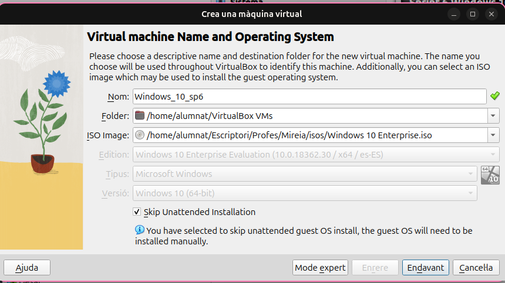

Modificamos la memoria RAM que le queremos añadir a la maquina virtual y los Cores que queremos que tenga asignados.


Creamos un disco duro de la maquina virtual.


Una vez lo tengamos podemos crear la maquina virtual y comenzar con su instalacion 

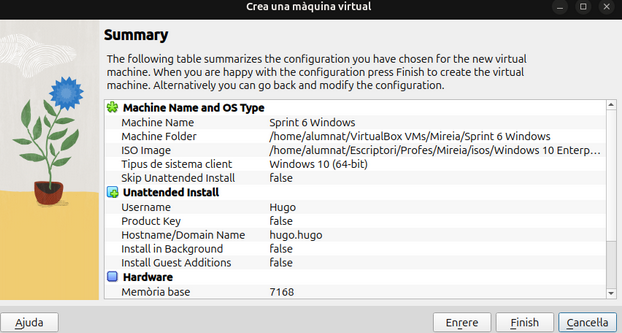

### Windows

Una vez la ejecutemos comenzara la instalacion pidiendo el idioma que queremos el S.O


Comenzaremos la instalacion despues de darle a "INSTALAR AHORA"

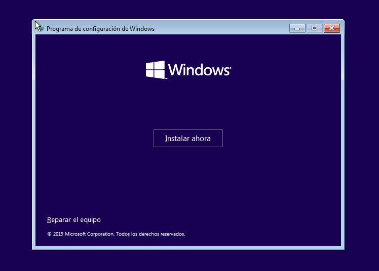

Nos pedira aceptar los terminos de Windows

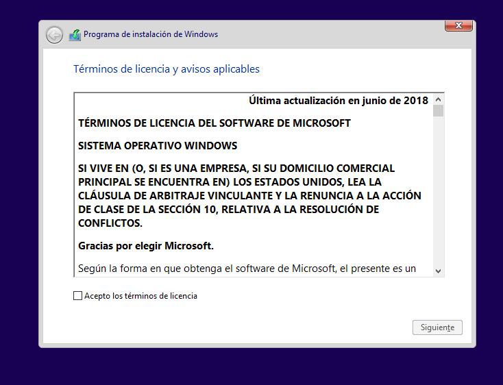

Indicamos la opcion que nosotros queramos seguir, en mi caso escogere la segunda ya que no hay archivos.

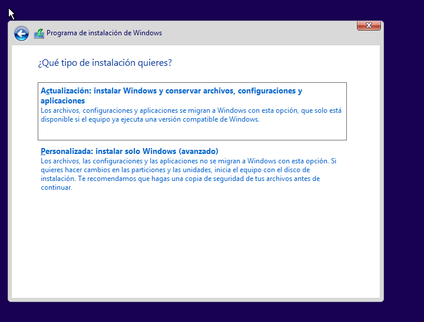

Escogemos el disco duro donde montar la instalacion


Ahora comenzara la instalacion automatica del S.O


Cuando acabe la instalacion seleccionaremos nuevamente el idioma


En todo este proceso nos hara preguntas sobre servicios que queremos que tenga el Windows que estamos instalando, no coloco las capturas porque no implica nada en la instalacion es a eleccion personal de lo que necesites. Una vez acabe se reiniciarala la maquina.

Una vez se vuelva a iniciar la maquina ya podemos utilizarla sin problema.

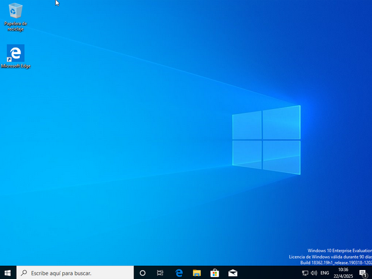

## Puntos De Restauración

### ¿Qué es un Punto de Restauración?

Un punto de restauración es una instantánea del estado actual del sistema operativo de un ordenador. Guarda información sobre archivos del sistema, configuraciones, y entradas del registro de Windows en un momento específico.

#### ¿Para qué sirve?

- Restaurar el sistema a un estado anterior sin afectar archivos personales.

- Solucionar problemas causados por cambios recientes.

- Revertir errores tras instalaciones defectuosas o virus (si no han afectado datos personales).

### Explicacion de como se hace

Abrimod el panel de control del sistema


De damos a "Sistema y Seguridad" y despues a sistema

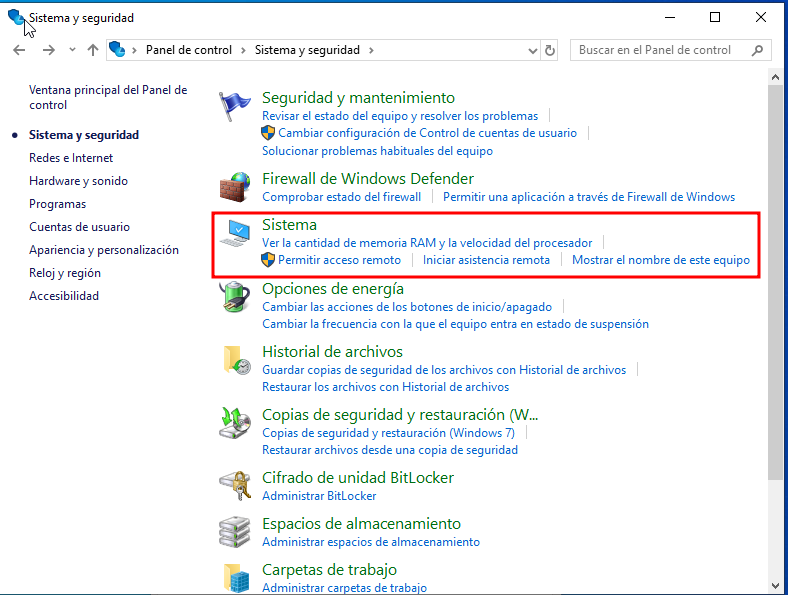

Despues le daremos a "proteccion del sistema"

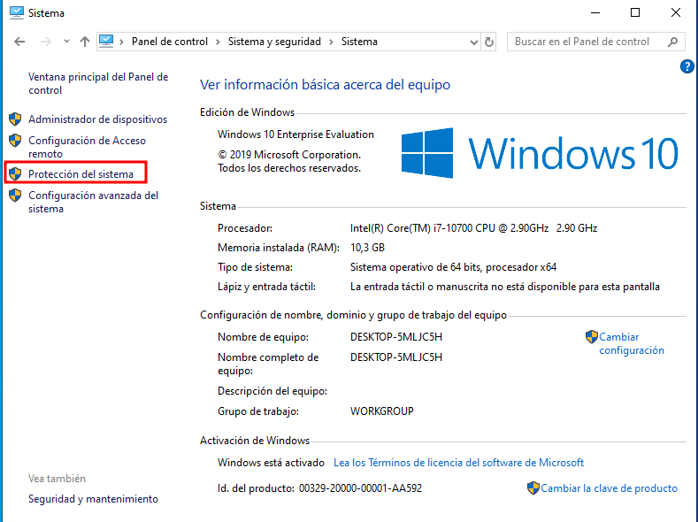

Si sale la proteccion del disco duro al que le queremos hacer la restauracion como "desactivada" tendremos que activarla

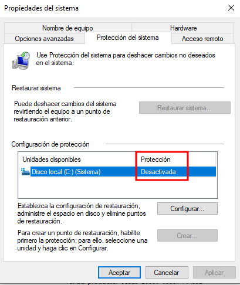


Una vez lo activemos podremos crear el punto de restauracion

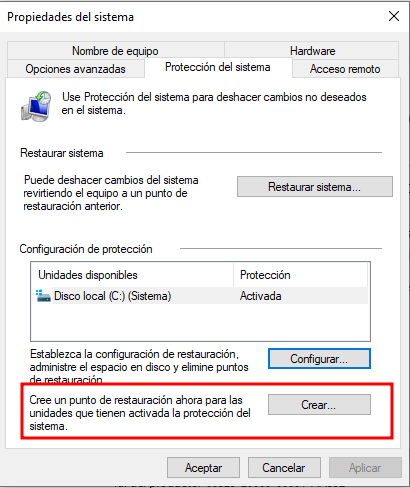

La Creamos y le colocamos un nombre a la restauracion

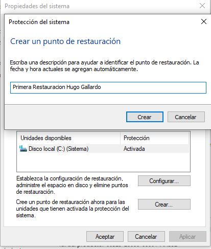

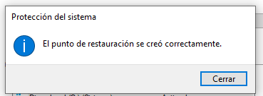

## Licencias

### ¿Qué es una licencia de software?

Una licencia de software es un acuerdo legal entre el creador del software (normalmente el desarrollador o la empresa que lo produce) y el usuario final. Este contrato define:

- Los derechos y limitaciones sobre el uso del programa.

- Cuántas instalaciones se permiten.

- Si se puede modificar, copiar o redistribuir.

- Si es un software gratuito o de pago.

### Tipos de licencias

Existen varios tipos de licencias, cada una con sus propias condiciones:

#### Licencia Propietaria

- El código fuente no está disponible.

- El usuario solo puede usar el software bajo ciertas condiciones estrictas.

- Ejemplos: Microsoft Office, Adobe Photoshop.

####  Licencia Libre o de Código Abierto

- El código está disponible para ver, modificar y distribuir.

- Ejemplos: Linux, GIMP, LibreOffice.

#### Licencia Freemium

- Parte del software es gratuita, pero se ofrecen funciones adicionales de pago.

- Ejemplo: Spotify, Zoom.

#### Licencia de Prueba o Demo

- Permite usar el programa durante un tiempo limitado.

- Ideal para evaluar antes de comprar.

### Licencias de Windows

El sistema operativo Microsoft Windows es un ejemplo claro de software con licencia propietaria. Algunas claves de sus licencias:

#### Tipos de licencias de Windows

1. OEM (Original Equipment Manufacturer)

    - Viene preinstalada en un ordenador nuevo.

    - Es válida solo para ese equipo, no se puede transferir a otro.

2. Retail (Venta al por menor)

    - Se compra por separado.

    - Se puede transferir a otro equipo, siempre que se desinstale del anterior.

3. Volume Licensing (Licenciamiento por volumen)

    - Diseñada para empresas u organizaciones que necesitan múltiples instalaciones.

    - Ejemplo: Licencias MAK (Multiple Activation Key) o KMS (Key Management Service).

4. Licencia Digital (Digital Entitlement)

    - Asociada a una cuenta Microsoft o al hardware del equipo.

    - Común en actualizaciones gratuitas (por ejemplo, de Windows 7 a 10).

#### Importancia de la licencia en Windows

- Evita problemas legales: usar una versión sin licencia es ilegal.

- Actualizaciones y soporte: solo disponibles para versiones correctamente activadas.

- Seguridad: las versiones no originales pueden contener software malicioso.

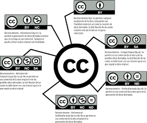

## Virtualizacion

### ¿Qué es la virtualización?

La virtualización es una tecnología que permite ejecutar uno o más sistemas operativos dentro de otro sistema operativo. Se logra creando máquinas virtuales (VM), que simulan un ordenador completo dentro de otro.

### ¿Para qué se usa?

- Probar sistemas operativos (Linux, Windows, etc.)

- Simular entornos de red o laboratorio

- Ejecutar software antiguo o de otros sistemas

- Crear servidores virtuales (desarrollo, testing, etc.)

### Herramientas de virtualización en Windows

🔹 VirtualBox / VMware Workstation

- Soluciones de terceros.

- Muy populares, fáciles de usar.

🔹 Hyper-V (integrado en Windows Pro/Education/Enterprise)

- Solución nativa de Microsoft.

- Permite crear y gestionar máquinas virtuales sin instalar programas externos.

- Solo disponible en ediciones Pro, Enterprise o Education.

Al ya haber explicado **VIRTUALBOX** en el primer apartado explicare ocmo activar Hyper-V.

### ¿Cómo habilitar Hyper-V en Windows?

Abrimos las caracteristicas de Windows que nos permitira activar y desactivar funciones de Windows varias.

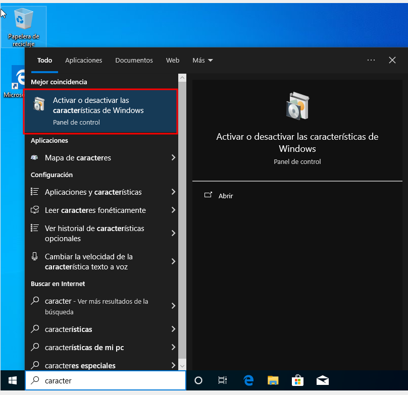

Activamos la opcion de **Hyper-V** para poder utilizar la virtualizacion integrada de windows, y cuando le demos a aceptar se instalara

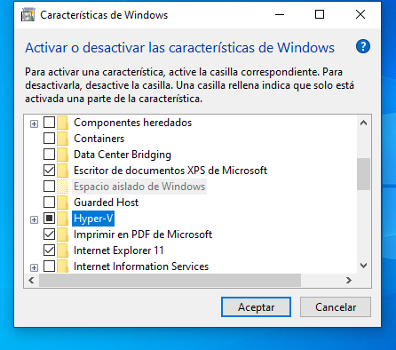


Ahora tendremos una nueva funcion en Windows buscando Administrador de Hyper-V

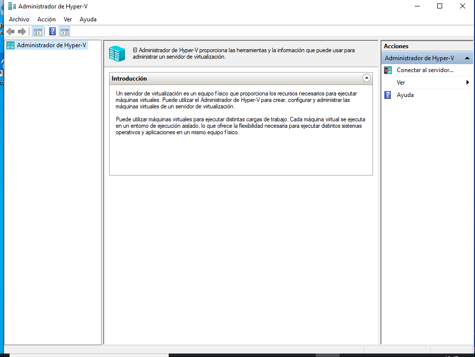

Aqui ya podriamos crear maquinas virtualies dandole click derecho en el panel derecho y a **CREAR**

## Gestores De Arranque

### ¿Qué es un gestor de arranque?

Un gestor de arranque es un pequeño programa que se ejecuta justo después de encender el ordenador. Su función principal es:

  -> Seleccionar y cargar el sistema operativo que se va a iniciar.

### ¿Cómo funciona?

- Cuando enciendes el PC, la BIOS/UEFI busca un dispositivo de arranque (disco duro, USB…).

- Encuentra el gestor de arranque en el sector de arranque del disco.

- El gestor muestra un menú (si hay varios sistemas), y carga el elegido.

### Tipos de gestores de arranque populares

#### Windows Boot Manager (BOOTMGR)

- El gestor de arranque predeterminado en sistemas Windows.

- Administra instalaciones de Windows múltiples.

- Menú simple, sin muchas opciones personalizables.

#### GRUB (GNU GRUB - Grand Unified Bootloader)

- Usado en la mayoría de distribuciones Linux.

- Muy potente y configurable.

- Permite arrancar sistemas Linux, Windows, otros, e incluso kernels personalizados.

#### LILO (Legacy)

- Antiguo gestor de arranque de Linux.

- Hoy casi en desuso, reemplazado por GRUB.

## Red Basica

#### ¿Qué es una red?

Una red informática es un conjunto de dispositivos (ordenadores, impresoras, routers, etc.) conectados entre sí para compartir información, recursos y servicios.

### Tipos de redes

#### LAN (Local Area Network)

- Red de área local.

- Cubre una zona pequeña como una casa, escuela o oficina.

- Alta velocidad, bajo retardo.

- Ejemplo: la red de ordenadores de un instituto.

#### WAN (Wide Area Network)

- Red de área amplia.

- Cubre grandes distancias (ciudades, países…).

- Ejemplo: Internet.

#### WLAN

- Red LAN pero inalámbrica (Wi-Fi).

#### PAN (Personal Area Network)

- Red de dispositivos personales (ej: Bluetooth entre móvil y auriculares).

En nuestro caso al hacerlo en una maquina virtual tenemos diferentes tipos de RED:

#### NAT (Traducción de Direcciones de Red)

- La VM accede a Internet a través de la red del host, como si fuera un dispositivo más detrás de un router.

- Sencillo de usar, ideal para navegar por Internet.

- No se puede acceder a la VM desde otros dispositivos de la red.

- Más seguro, pero limitado para servidores.

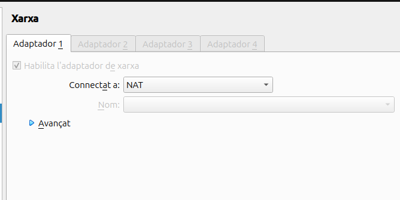

#### Adaptador puente (Bridge Adapter)

- La VM se conecta directamente a la red física, como si fuera un dispositivo más (con su propia IP).

- Puede comunicarse con otros dispositivos de la red, y ellos con ella.

- Permite acceder a la VM desde el exterior (como un servidor).


#### Red interna (Internal Network / Xarxa interna)

- Solo permite conexión entre máquinas virtuales conectadas a la misma red interna.

- No hay acceso al host ni a Internet.

- Se utiliza para laboratorios aislados o simulaciones.

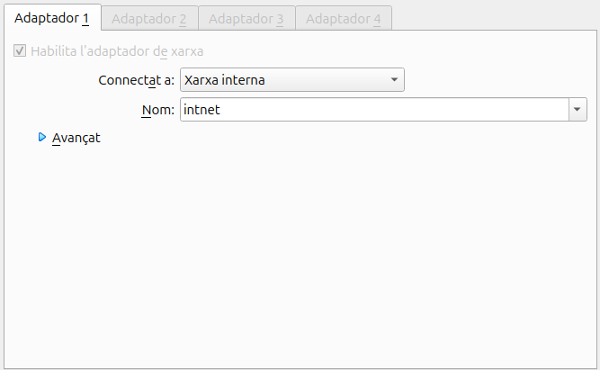

#### Adaptador solo anfitrión (Host-only)

- La VM se conecta solo con el sistema host y otras VMs configuradas igual.

- No hay conexión directa a Internet, salvo que se configure un puente NAT.

- Útil para establecer comunicación entre host y VM sin exponerla a la red externa.


#### Controlador genérico

- Para configuraciones de red más avanzadas con drivers personalizados o redes virtuales propias.

- Poco común en uso estándar.

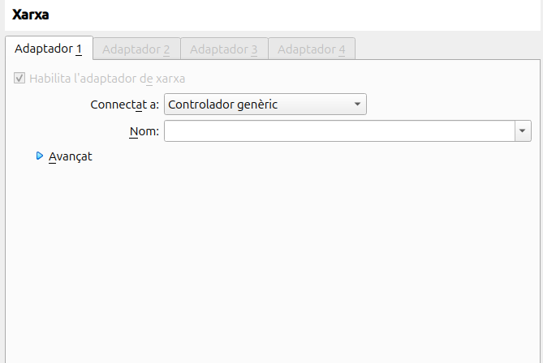

#### Red NAT (Xarxa NAT)

- Similar al NAT tradicional, pero permite configurar una red privada interna con reglas de reenvío de puertos.

- Se pueden conectar varias VMs entre sí, manteniendo acceso a Internet.

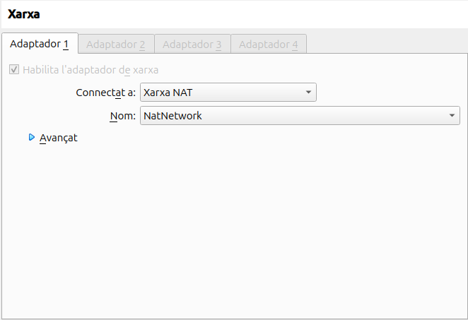


## Comandos Generales 

Estos comandos se utilizan en la Consola de comandos (CMD) o en PowerShell, y permiten realizar tareas de administración, diagnóstico o navegación por el sistema.

### Comandos de navegación y gestión de archivos

```dir``` -> Muestra el contenido del directorio actual


```cd``` -> Cambia de directorio (cd .. para subir un nivel)
 


```cls``` -> Limpia la pantalla de la consola

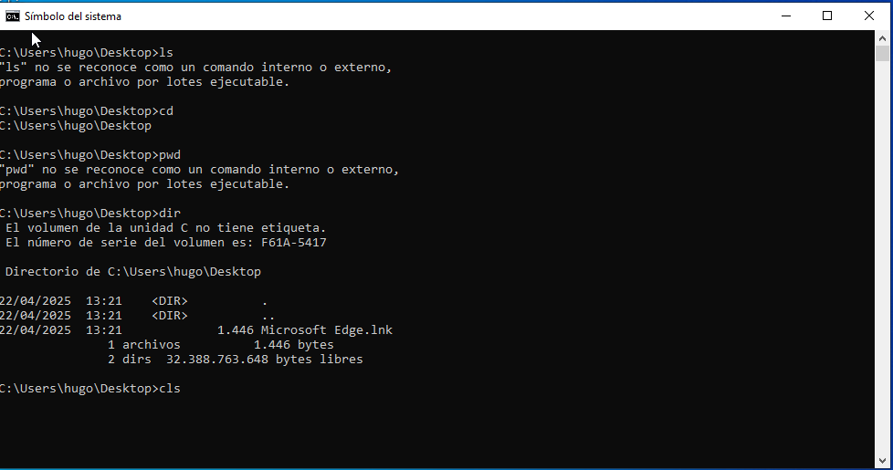


```copy archivo1 archivo2``` -> Copia archivos

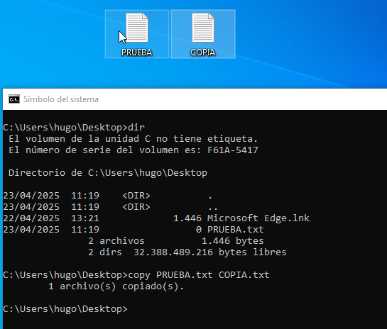

```move archivo1 carpeta``` -> Mueve archivos a otra carpeta

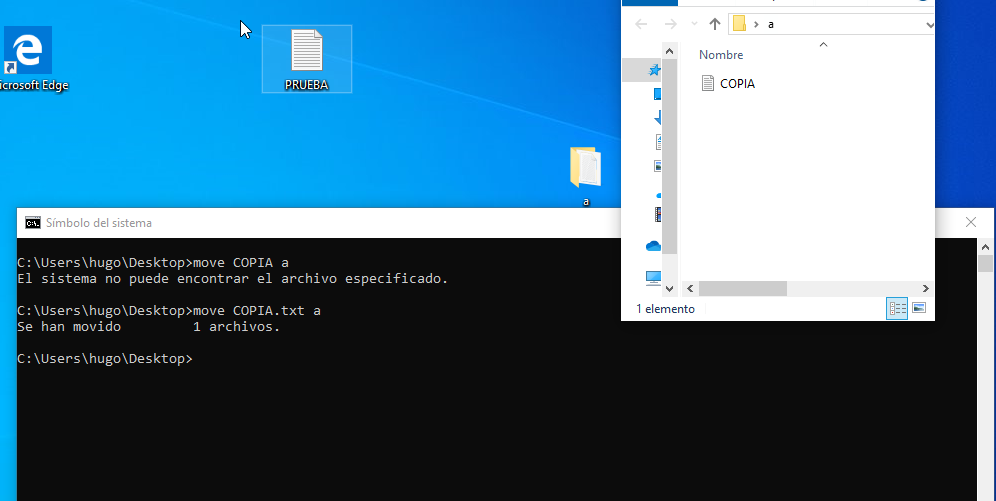

```del archivo``` -> Elimina un archivo


```mkdir nombrecarpeta``` -> Crea una carpeta


```rmdir nombrecarpeta``` -> Elimina una carpeta

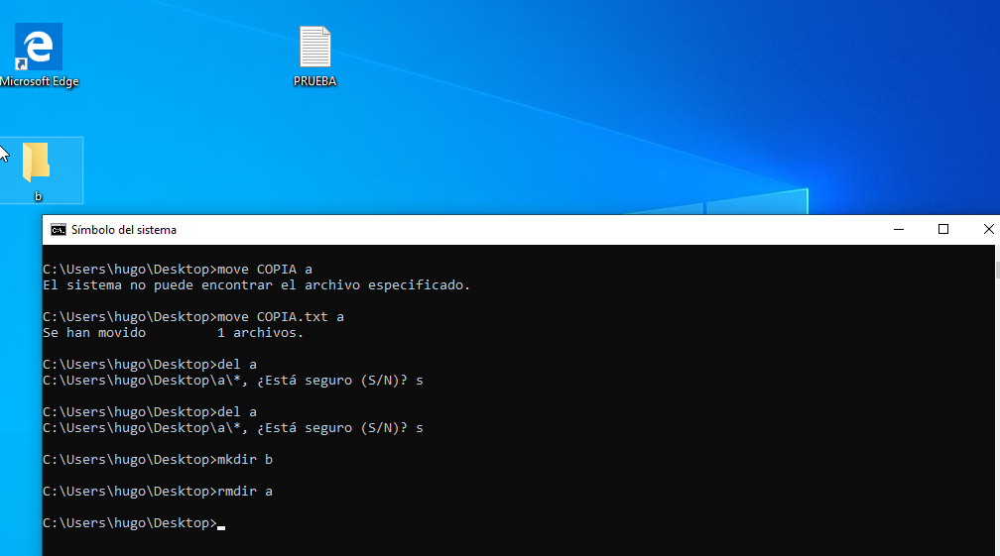

## Instalaciones aplicaciones

La instalacion de Windows es mucho mas sencilla que en Linux ya que en muchas ocasiones se tratara de un ```.exe``` el cual ejecutaremos despues de haberlo descargado de google y nos instala la aplicacion automaticamente.

### Instalacion Google Chrome

Abrimos el explorador que tengamos instalado y buscamos la aplicacion que queramos instalar en mi caso CHROME

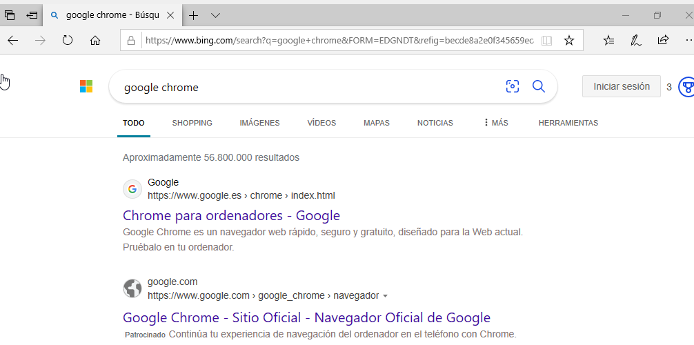

Abrimos el primer enlace que me a salido en mi caso (en ocasiones puede estar algo mas escondido) y le damos a descargar CHROME


Ya vermiamos como se a instalado dandole a **Ctrl + J** en google.

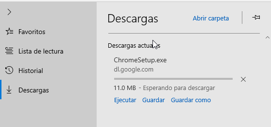

Si no cambiamos la ruta por defecto el archivo descargado tendria que ir a la carpeta de Descargas como manera predeterminada


Ejecutamos el instalador que se nos a descargado en mi caso "ChromeSetup" y comenzara a instalarse

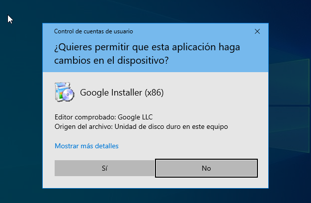

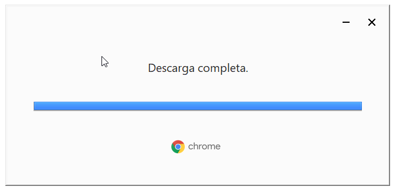

Una vez finalice la instalacion podriamos comenzar a utilizar la app sin ningun tipo de problema

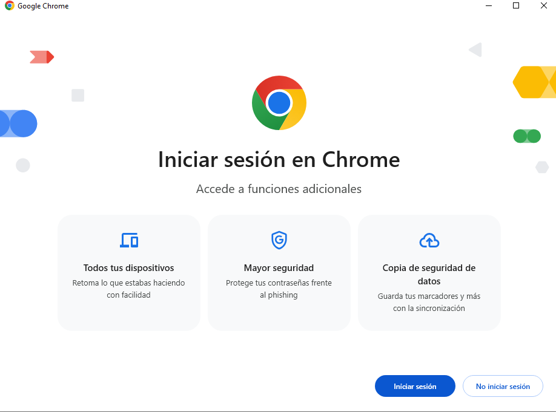

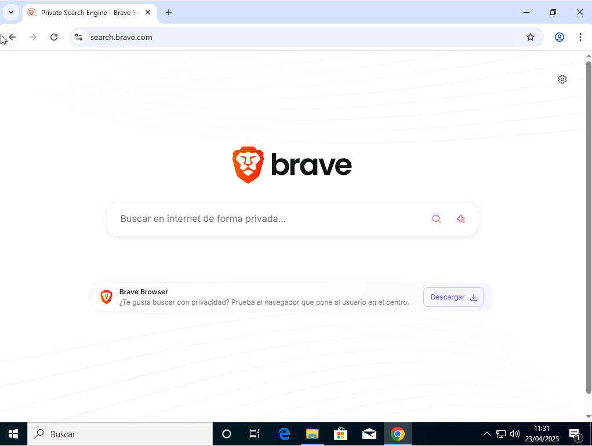
