# Sprint 2

## Gestión de procesos

**¿Que es un proceso?** Un proceso es una instancia de un programa en ejecución en un sistema operativo. Es decir, cuando ejecutas un programa, el sistema operativo crea un proceso que representa ese programa mientras está funcionando.

### **TOP** 

Es un comando que se utiliza para monitorear a tiempo real los **procesos** que se estan ejecutando en el sistema en ese momento.

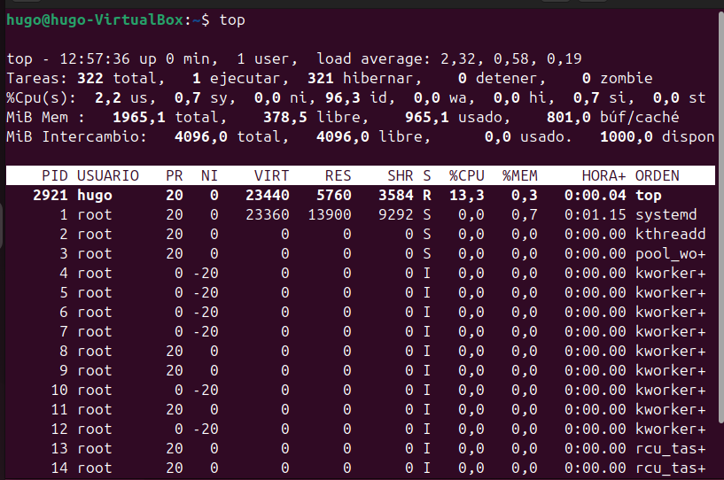

### **pstree**

La comanda pstree muestra una representación en forma de árbol de los procesos que se están ejecutando en un sistema basado en Unix/Linux. 

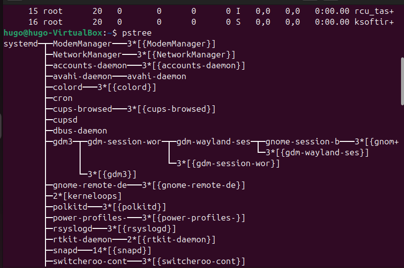

### **ps aux**
se utiliza para listar todos los procesos que se están ejecutando en el sistema, proporcionando información detallada sobre cada uno de ellos.

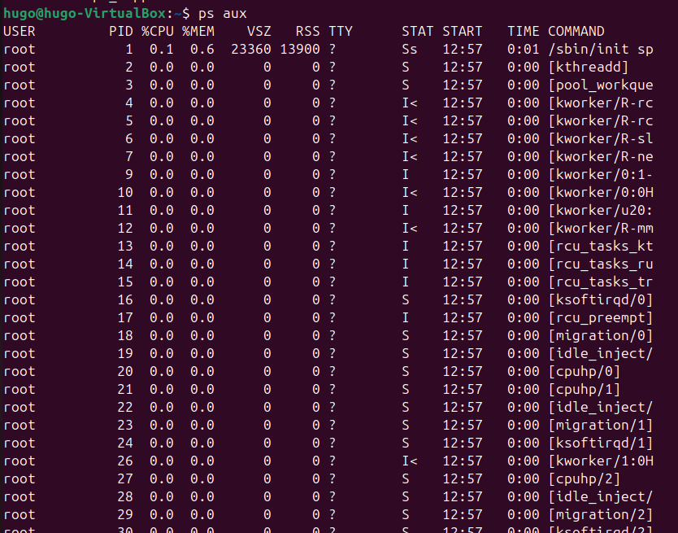

### Ctrl+C

Ctrl + C se utiliza para interrumpir o detener un proceso en ejecución en la terminal. 

**Ejemplo:**

Ejecutamos un Ping hacia una IP aleatoria, en mi caso utilizare la 8.8.8.8

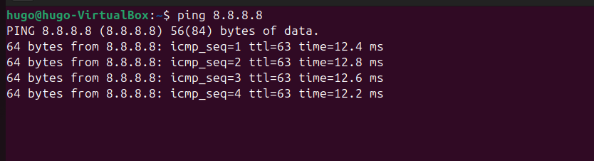

Para detener este proceso utilizaremos la combinacion de teclas **Ctrl+C** y se representara en la terminal de esta manera **^C**, esto hara que se detenga el proceso y por lo tanto se dejaran de mandar Pings.

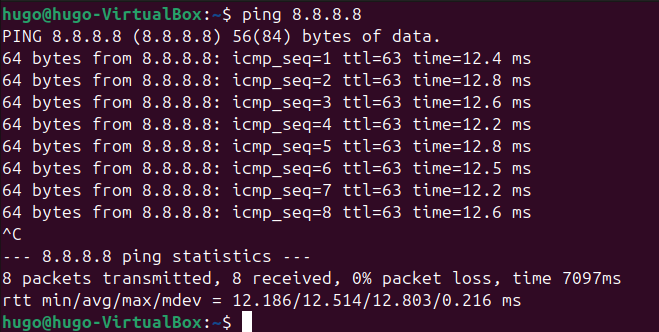


### Ctrl+Z

 Ctrl + Z se utiliza para suspender un proceso en ejecución y enviarlo al fondo, deteniéndolo temporalmente.

**Ejemplo**

Haremos el mismo ejemplo que en el caso anterior, le enviaremos un ping a la IP 8.8.8.8.

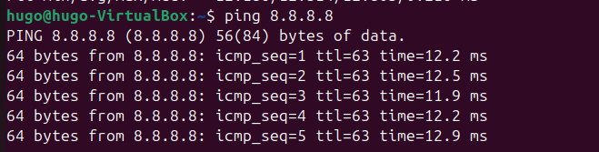

Para suspender el proceso y enviarlo a un segundo plano haremos **Ctrl+Z** y se representara en la terminal de esta manera **^Z** esto hara que se suspenda el proceso y se mande a un segundo plano.

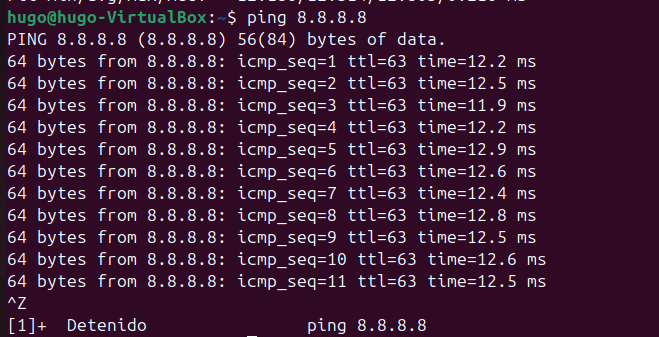

### jobs

El comando jobs muestra una lista de los procesos asociados a la sesión actual de la terminal que están en segundo plano, suspendidos o en ejecución.  

**Ejemplo**

Suspendemos un proceso para poder hacer un ejemplo


Ahora ejecutamos la comanda ```jobs``` para ver los procesos suspendidos

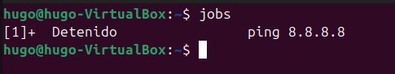

### fg %

El comando fg % se utiliza para reanudar un trabajo suspendido o en segundo plano y traerlo al primer plano de la terminal, permitiéndote interactuar nuevamente con él.

**Ejemplo**

Vamos a traer nuevamente el ping que suspendimos anteriormente y pudimos verlo con el ```jobs```.


Para volverlo a traer al primer plano haremos ```fg % numero_proceso``` en este caso el numero "1".


### kill -9 PID

El comando kill -9 PID se utiliza para forzar la terminación de un proceso identificado por su PID (Process ID).

**Ejemplo**

Para ver los procesos que tenemos activos ahora mismo vamos a usar el comando ```ps aux```


Y para deter alguno de los procesos que podemos ver en pantalla utilizaremos ```kill -9 PID```.


No sale ningun tipo de mensaje pero si volvemos a hacer ```ps aux``` podremos comprobar que ya no aparecera en la lista.

## Gestión de usuarios, grupos
### Archivos a tener en cuenta

#### *- PASSWD*

**Ruta:** ```/etc/passwd```

**Extructura:** nombre:contraseña(x):id_usuario(1xxx):grupo_principal(1xxx):nombre_completo:Direccion_Directorio

**Funcionalidad:**  Contiene la información básica de las cuentas de usuario del sistema. 

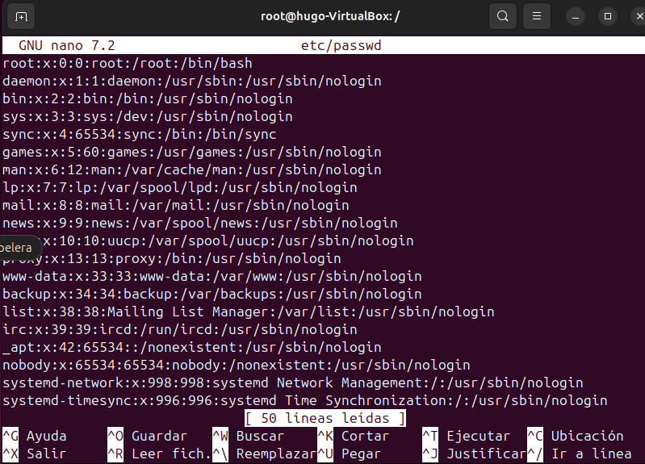

#### *- GROUP*

**Ruta:** ```/etc/group```

**Extructura:** nombre;contraseña:identificador:(Mas usuarios si hay)

**Funcionalidad:** Contiene la información sobre los grupos definidos en el sistema. 

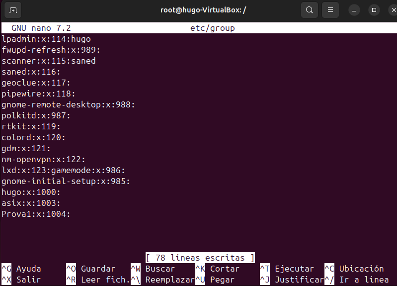

#### *- SHADOW*

**Ruta:** ```/etc/shadow```

**Extructura:** nombre_de_usuario:contraseña_cifrada:último_cambio:min:max:aviso:inactividad:expiración:

**Funcionalidad:** Almacena la información cifrada de las contraseñas de los usuarios, así como otros parámetros relacionados con la expiración y validez de las contraseñas.

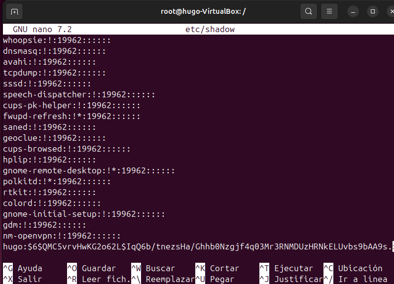


#### *- GSHADOW*

**Ruta:** ```/etc/gshadow```

**Extructura:** nombre_del_grupo:contraseña_cifrada:administradores:miembros

**Funcionalidad:** Se utiliza para almacenar información de los grupos, incluyendo las contraseñas cifradas de los grupos y los miembros de cada grupo con permisos especiales. 

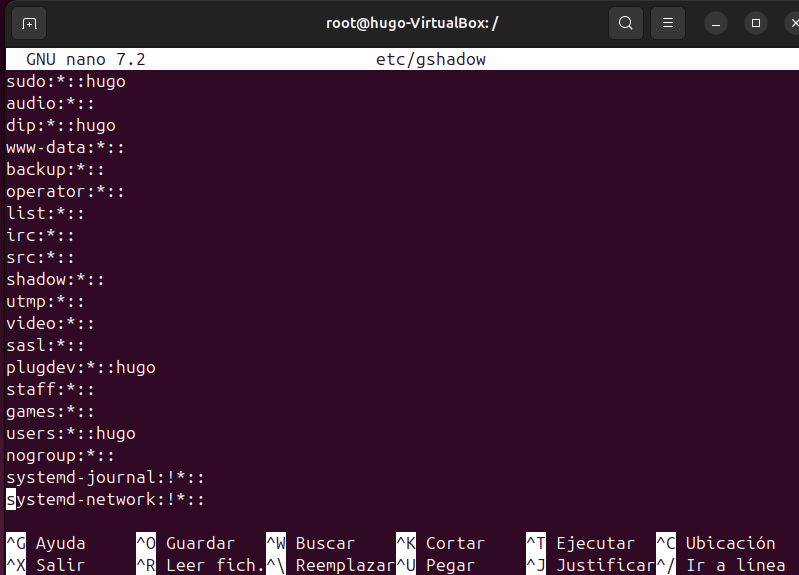

**SKEL**

***Todos los archivos mencionados se encuentran dentro del skel, para poder verlos tendremos que hacer un ```ls -la``` ya que todo archivo que tenga un "." antes de su nombre estara oculto y no se vera con un simple ls***

```/etc/skel``` -> Carpetas que se crearan cuando un nuevo usuario abra la interfaz por primera vez

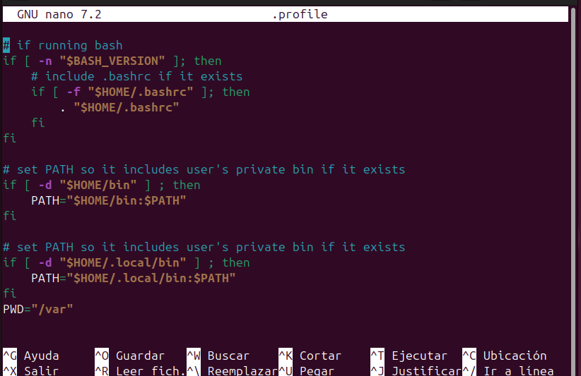

**.profile** -> Este archivo se ejecuta cuando inicias sesión en un shell de login (por ejemplo, cuando accedes al sistema desde un terminal virtual o SSH).

**Modificacion** -> En este caso indicamos que la carpeta de home del usuario en vez de crearse en el /home se crearan en el /var

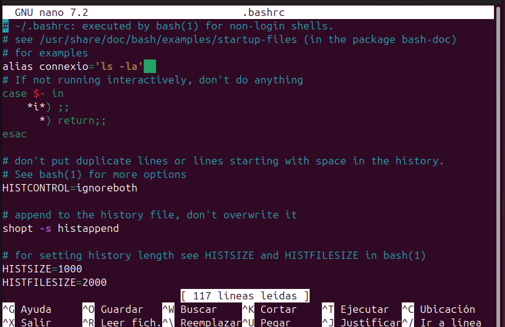

**.bashrc** -> Sirve para configurar cosas como alias, funciones, colores, y otras personalizaciones del shell.

**Modificacion** -> En este caso estamos creando una modificación de un comando, cuando coloquemos "conexio" se hara un ```ls -la```

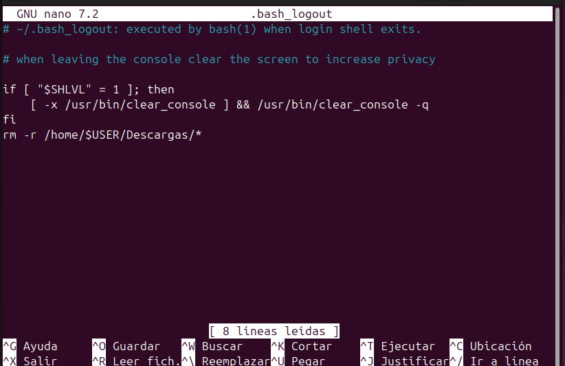

**.bash_logout** -> Este archivo se ejecuta al cerrar sesión en un shell de login.

**Modificacion** -> En este caso estamos haciendo que siempre que se deslogue se eliminara la carpeta de descargas de los usuarios que tengan la carpeta en /home

**VARIABLE: $USER** -> actua únicament sobre l’usuari que es deslogea.


### Usuarios

### Comandos Basicos


#### *Creación de usuarios*

Para crear usuarios tenemos 2 comandos los cuales podemos usar useradd y adduser.

##### **useradd:**

- Es un comando más básico y de bajo nivel.
- Forma parte de las herramientas de gestión de usuarios de Linux.
- No realiza pasos adicionales ni configura parámetros automáticamente. Por ejemplo, al usar useradd, hay que especificar manualmente la creación del directorio home, los grupos, la shell, y otras configuraciones si no se desea usar los valores predeterminados.
- Ideal para usuarios avanzados que necesitan personalizar cada aspecto de la cuenta.

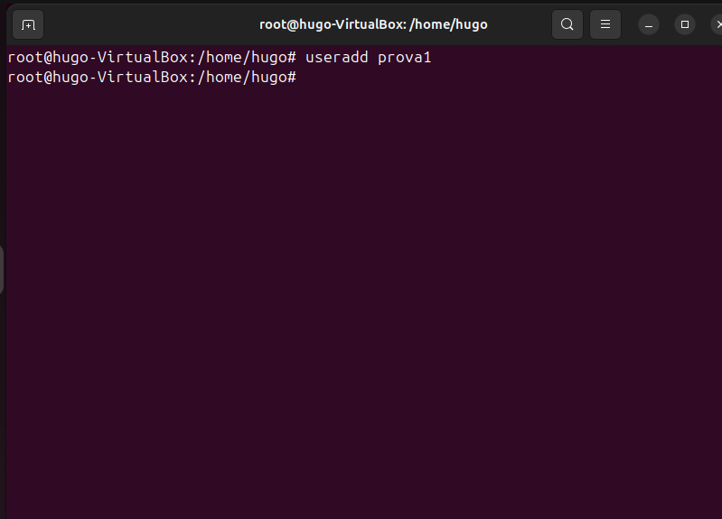

Creamos su home con el comando ```mkdir``` y le entregamos el propietario con el comando ```sudo chown```.


Le añadimos una contraseña al usuario


Le asignamos el Shell predeterminado

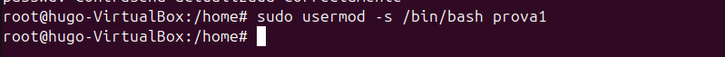

Comprobamos que se encuentre en los archivos y en la inteficie grafica:

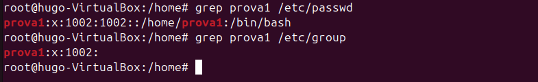

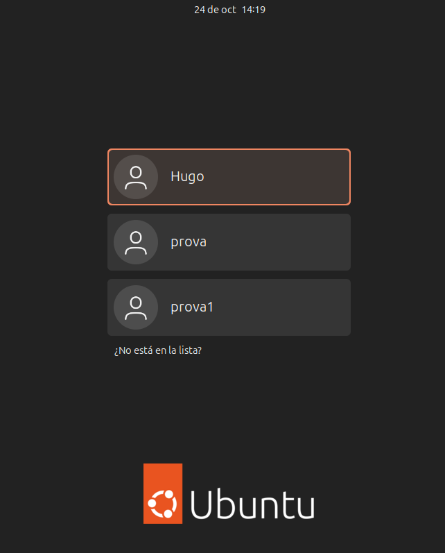
##### **adduser:**

- Es un script de Perl que utiliza useradd internamente.
- Proporciona una interfaz más amigable y realiza varias configuraciones por defecto, como la creación automática del directorio home, la asignación de un grupo por defecto, y la solicitud de una contraseña durante el proceso.
- Es más sencillo y práctico para usuarios que quieren crear cuentas de usuario sin preocuparse por especificar cada parámetro.

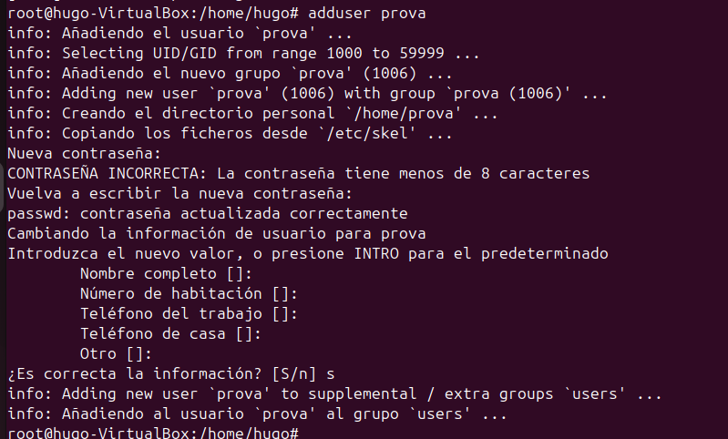

**RESULTADOS:**

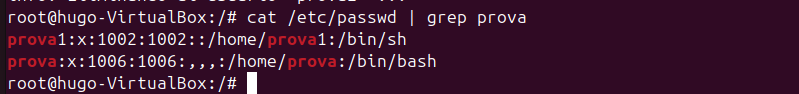

### *Eliminar Usuarios*

El comando **deluser** en sistemas Unix/Linux se utiliza para eliminar usuarios del sistema de manera sencilla.

1 - **Eliminar un usuario:**

Si se ejecuta sin opciones adicionales, deluser elimina al usuario especificado del sistema, pero deja intactos los archivos del usuario, incluyendo su directorio home.

```deluser nombre_de_usuario```

2 - **Eliminar un usuario y su directorio home:**

Usando la opción --remove-home, deluser elimina al usuario junto con su directorio home y su contenido.
    
```deluser --remove-home hugo```

3 - **Eliminar un usuario y sus archivos:**

Con la opción --remove-all-files, deluser elimina todos los archivos de propiedad del usuario, independientemente de su ubicación en el sistema, además del directorio home.
   
``` deluser --remove-all-files hugo```


4 - **Eliminar un usuario de un grupo:**

deluser también permite eliminar a un usuario de un grupo específico sin eliminar al usuario del sistema.

```deluser hugo sudo ```

5 - **Eliminar un grupo:**

También se puede usar deluser para eliminar un grupo utilizando la opción --group.

```deluser --group grupo1```

### *Bloquear Usuarios*

```usermod -L <nom>```

cat /etc/shadow 

Comprovamos que delante del password aparece un "!" para verificar que se a bloqueado

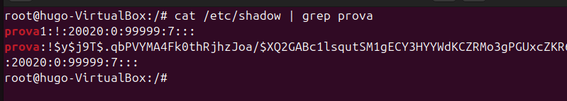

```man usermod``` (opcions de usermod)

```usermod -U <nom>```

Desbloquea al usuario por lo tanto desaparece el '!' del /etc/shadow

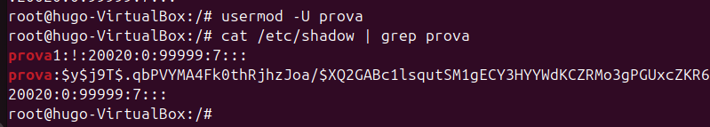


#### Otros comandos
- ```usermod --shell /bin/bash <nom> ``` (para cambiar el interprete de 'sh' a 'bash')

- ```mkdir <nom>``` (crea carpeta para un nuevo usuario)

- ```chown <nom>:<nom> <nom>``` (1:usuari 2:grup 3:nom carpeta)

- ```passwd <nom>``` (para configurar contraseña)

- ```usermod -p <contrasenya> <nom>``` (contraseña con texto plano)

- ```addgroup <nom>``` (crea un grupo con su id)
- ```adduser <nom> <nombre_grupo>``` (añade un usuario dentro de un grupo)

##### GPASSWD

- ```gpasswd -a <nom> <nombre_grupo>``` (añade un usuario a grup)

- ```gpasswd -A <nom> <nombre_grupo>``` (hace que un usuario sea admin de un grupo)

##### USERMOD

- ```usermod -a -G <nomg> <nom> ```(añade un usuario a un grupo y con la '-a' no elige el usuario de otros grupos)

- ```usermod  -G <nombre_grupo> <nombre>``` (cambia el grupo principal del usuario)


- ```groupmod -n <Nuevo_nombre_grupo> <nombre_grupo>``` (cambia el nombre del grupo)

### Modificaciones crear usuarios

Los archivos que vamos a modificar en esta parte y los importantes son:


- /etc/login.defs -> modifica los parametros a la hora de crear usuarios en general.

- /etc/adduser.conf -> Modifica parametros al usar el comando adduser.

- /etc/default/useradd -> Modifica parametros al usar el comando useradd.

- /etc/skell -> Todo lo que se cree dentro de esta carpeta se copiara en las homes de cada usuario creado


#### Configuracion Skell
En el Skell si haces un **ls -la** te saldran muchos archivos los cuales estan ocultos y ya explique anteriormente para que servian, en este caso lo que nos va a interesar es crear un enlace para comprovar si se crea en los nuevos usuarios.

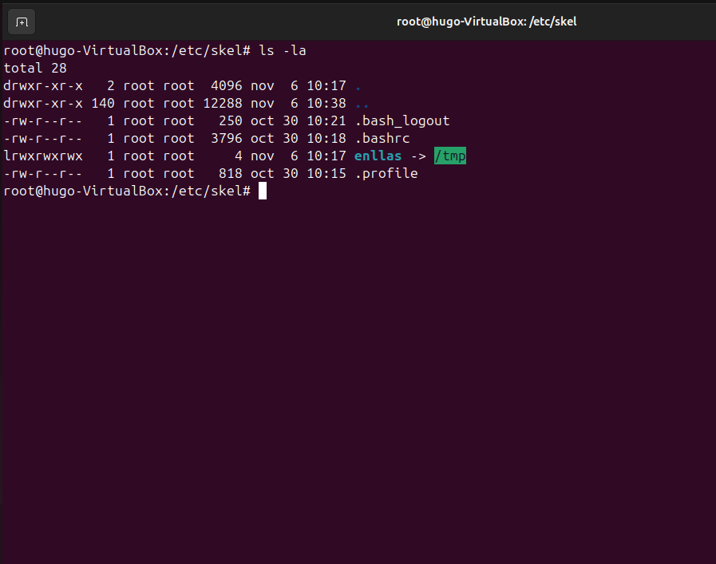

#### Configuración login.defs
Como mencione anteriormente este archivo modifica los parametros defaults a la hora de crear un usuario.


En este caso los parametros que se modificaron son

- **UID_MIN 2000** -> Esto hara que su numero de usuario sea minimo 2000 de manera default seria 1000

- **GID_MIN 2000** -> Esto hara que el numero de grupo sea minimo 2000 de manera default seria 1000

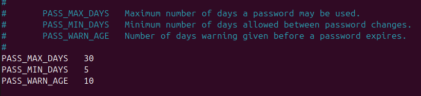

Tambien se modifico este apartado del mismo archivo el cual hara cambios con la contraseña.

- **PASS_MAX_DAYS 30** -> Esto hara que la misma contraseña solo se podra tener durante 30 dias, despues se tendra que cambiar
- **PASS_MIN_DAYS 5** -> Esto hara que tienen que pasar minimo 5 dias entre cambio y cambio de contraseña
- **PASS_WARN_AGE 10** -> Esto hara que te avise 10 dias antes de que te caduque la contraseña.

#### Configuración adduser.conf
Todo lo que se toque en este archivo cambiara los parametros a la hora de crear un usuario con el comando ```adduser```. Todo lo que se ponga en este archivo prevalece sobre lo que se ponga en el archivo login.defs.


En este archivo se modificaron los siguientes parametros:

- **DHOME=/tmp** -> Esto hara que las carpetas "home" de los usuarios no se crearan en la carpeta "HOME" sino en la ruta que tu le pongas en este caso en "/tmp"
- **FIRST_UID=2000** -> Esto hara que su numero de usuario sea minimo 2000 de manera default seria 1000
- **FIRST_GID=2000** -> Esto hara que el numero de grupo sea minimo 2000 de manera default seria 1000


###### Comprobaciones


#### Configuración useradd
Todo lo que se toque en este archivo cambiara los parametros a la hora de crear un usuario con el comando ```useradd```


En este archivo viene todo siempre completamente comentado ya que nunca te pide especificaciones a la hora de crear un usuario ya que lo tienes que hacer manualmente.

Lo unico que se descomento es el paraemtro:
- **SHELL=/bin/bash** -> Esto determina el SHELL de cada usuario creado con useradd en este caso seria /bin/bash.


Igualmente las modificaciones que se seguirian en la creación de un usuario con useradd serian las indicadas en el archivo ```login.defs```

## Permisos
#### Taula Permisos Decimal


#### Permisos Normals
**PRUEBAS**
Para hacer las pruebas creamos un grupo y usuarios, añadimos a 2 de los usuarios creados dentro del grupo en este caso se llama “parchis”

Metemos 2 usuarios al grupo:


**chgrp**
Creamos la carpeta “prova” con un archivo en el interior llamado “hola” y le modificamos los permisos añadiendo al grupo parchis.


Añadimos al grupo como propietario:

El comando que utilizamos es ```chgrp```

**Estructura:** ```chgrp [Parametre] [Grup] [Directori/archiu]```

En nuestro caso utilizamos **“-R”** esto hara que sea recursivo, es decir que todo lo que haya en el interior de la carpeta tambien se le aplicaran los permisos.


**CHMOD**
Ahora cambiamos los permisos tambien para el resto de grupos/usuarios/


**Orden:** Usuario-Grupo-Others

**Estructura:** ```chmod [Parámetro] [Permisos que quieres otorgar] [Carpeta]```

En nuestro caso utilizamos **“-R”** esto hará que sea recursivo, es decir que todo lo que haya en el interior de la carpeta también se le aplicarán los permisos.

**PRUEBAS GROC (Permisos Ususari)**


Podemos comprobar que con la configuración que le hemos dado GROC al tener permisos de usuario puede hacer lo que sea dentro de la carpeta.

**PRUEBAS VERDE (Permisos Grup)**


Podemos ver que “Verd” ya que tiene los permisos de grupo únicamente podrá entrar y ver el contenido del interior del directorio, pero no podrá modificar nada de su interior ni ver el contenido de los archivos del interior.

**PRUEBA ROIG (permisos Others)**


Podemos ver que “Roig” ya que tiene los permisos de Others no podrá ni acceder ni modificar el interior del directorio,

#### Permisos Especials

Para comprobar los permisos especiales utilizaremos una carpeta llamada Compartida, queremos que en esta carpeta todos los usuarios dentro del grupo de parchís puedan subir sus archivos y ver el interior pero no pueda eliminar los archivos del resto.

**Creamos la carpeta**


**Sticky:**

Utilizaremos el chmod, le añadiremos unos permisos normales “757” pero le colocaremos un “1” delante, esto hace que se le apliquen todos los permisos al grupo de Others pero no puedan eliminar documentos de otros usuarios.


**Comprobaciones:**

Creo 2 carpetas con el usuario “Roig” para comprobar que puede crear archivos en el interior de la carpeta, seguidamente compruebo que el puede eliminar sus propios archivos.

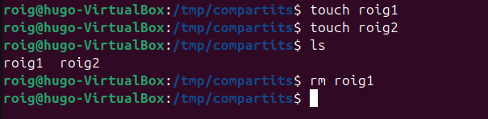

Ahora cambio al usuario “Blau” y compruebo que puede crear sus archivos y que no puede eliminar los de Roig.

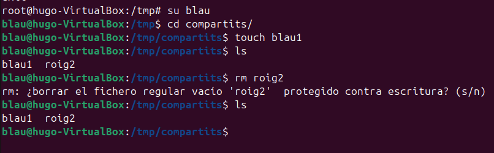


#### Llista de control d'acces

Para crear la lisa de controles utilizaremos el comando:

```getfacl [Nombre archivo]```

El comando getfacl en Linux se utiliza para mostrar las Listas de Control de Acceso (ACL) de archivos y directorios.


**setfacl**

Este comando nos servirá para hacer excepciones sobre carpetas a usuarios en concreto o grupos en concreto

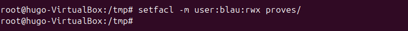

Estructura: ```setfacl -m [user/group]:[usuari/grup]:[permisos] (nom carpeta)```

**Comprobaciones**


**Otros parametros**

```setfacl -b (archivo)``` → Sirve para eliminar todas las excepciones que esten en un archivo/directorio


```setfacl -x (usuario) (directorio)``` → Sirve para eliminar las excepciones de 1 usuario en concreto sobre 1 directorio.


#### Permisos umask

```umask``` -> comprobar la máscara que tienes

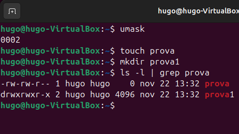

**La mascara 022** = máscara del **root**

```umask (numero)``` -> Te cambia la máscara al numero que tu le asigne

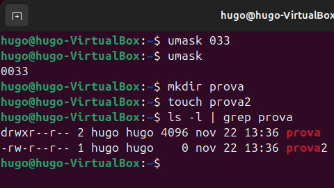

* Dependiendo el número de mascaras indicará los permisos que se le otorgaran a los directorios y archivos.

**Para calcular la mascara:**

Para calcular los permisos que dará una máscara hay que hacer la operación ahn con números binarios entre los permisos que se otorgan de manera default en el SO en el caso de los directorios (777) y en el caso de los archivos (640), seguidamente tienes que pasar a binario la máscara que tengas en nuestro caso 002 despues hacerla a la inversa es decir los 0->1 y 1->0, después al realizar el cálculo ahn hay que volver a invertir la máscara que nos dará es decir los 0->1 y 1->0, seguidamente pasamos nuevamente de binario a decimal y esa sera la máscara que tendremos que usar.

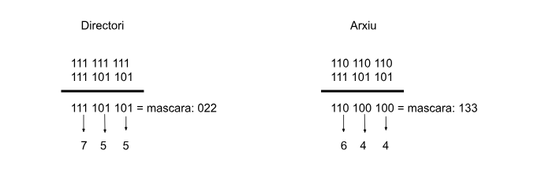

**Modificar umask para nuevos usuarios:**

Usaremos el archivo ```/etc/login.defs``` 

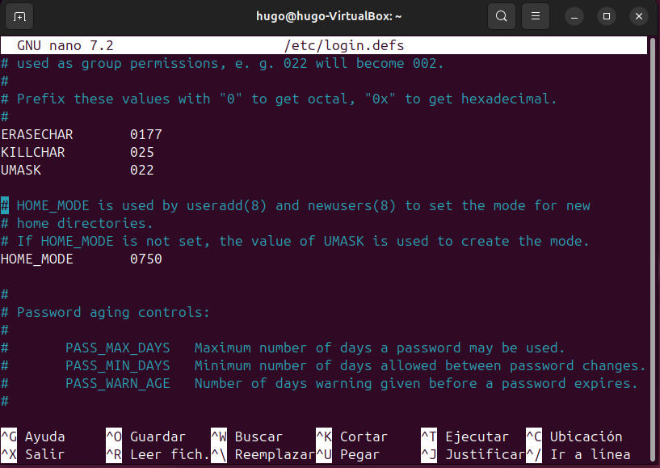

Modificaremos el parámetro **UMASK -> 022** al número que nosotros queramos.

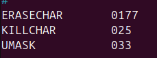

Creamos el nuevo usuario para comprobar que se a cambiado:

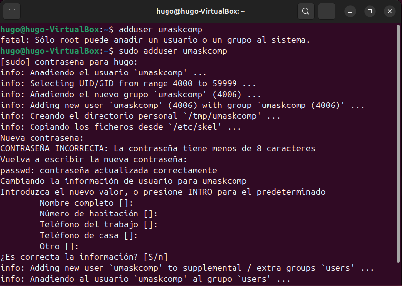


## Sistemes de fitxers i particions
### COMANDES:
```fdisk -l ```-> Da información sobre los discos del sistema operativo.
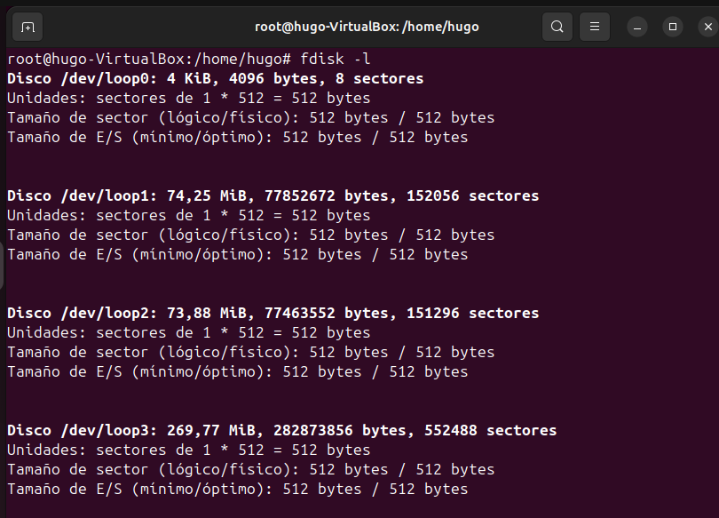

```tune2fs -l (partició)```-> Sabremos la mida del Block que tiene servida la partición.
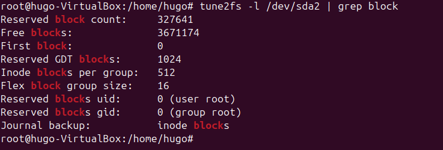

```df -T``` -> Sirve para ver todas las particiones que tenemos y el sistema de archivos y mas información.
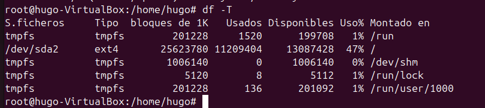

```du -sh (archivo)``` -> Sirve para obtener información sobre el tamaño de un archivo o directorio en un formato más fácil de leer para las personas.
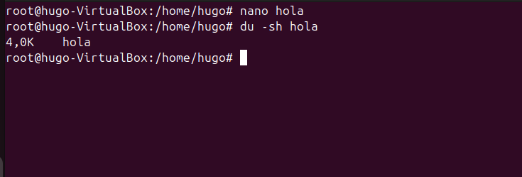

```e4defrag -c (partición)``` -> Es un desfragmentador de Linux, con el parámetro “-c” únicamente dará información necesaria para saber si tenemos que desfragmentar el disco.

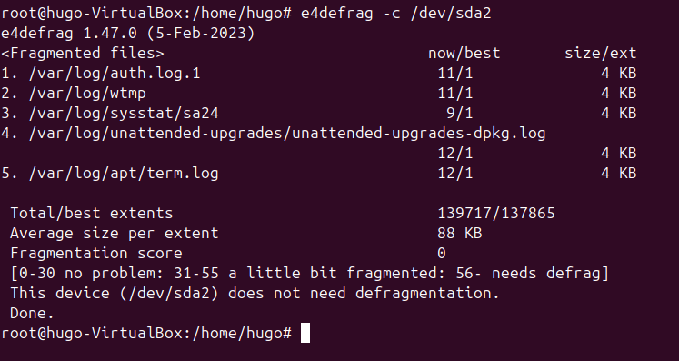

```e4defrag (partición)``` -> Sirve para comenzar a desfragmentar 


### Estructura de la informació:

#### Mida sector y block:

El sector es la unidad mínima física donde se guardan los datos y por defecto son 512 bytes y el sistema operativa no trabaja en sectores trabaja en blocks y los blocks es la unidad mínima lógica donde se guardan los datos por defecto. El tamaño del sector no se puede cambiar viene definida de fábrica, pero el tamaño del block si que se puede cambiar cuando formateamos la partición.


#### Fragmentació interna:

La fragmentación interna es toda esa parte desaprovechada de los blocks porque no se acaban de llenar.

La fragmentación interna se puede solucionar disminuyendo o aumentando la medida del block pero siempre hay que tener en cuenta que bajará el rendimiento ya que los archivos estarán más fraccionados

#### Fragmentació externa:

La fragmentación externa cunado baja el rendimiento del sistema porque los archivos no se guardan en bloques continuos en la memoria, lo arreglamos con la desfragmentación.

## Creación de particiones y formatear

### Tipo de formateo
- **Bajo nivel (lento)**
Realiza una operación de bajo nivel en el disco que organiza físicamente los sectores y las pistas. Básicamente prepara el medio de almacenamiento (generalmente discos magnéticos) para poder guardar datos desde cero. Se asignan los sectores físicos del disco y se marcan las áreas defectuosas

- **Entre Medio**
Elimina toda la información lógica del disco, crea un sistema de archivos nuevo (FAT, NTFS, ext4, etc.) y revisa el disco en busca de errores (con un escaneo superficial). Este proceso sobrescribe los datos existentes y hace que parezca un disco nuevo a nivel lógico.

- **Rapido**
Borra solo la tabla de asignación de archivos (o su equivalente según el sistema de archivos), lo que significa que los archivos existentes no se eliminan físicamente, pero el sistema operativo “piensa” que el espacio está vacío y puede escribir sobre él. Es un proceso mucho más rápido porque no escanea ni sobrescribe sectores.

### Practica
Creamos un nuevo disco en el Virtual box para poder trabajar con el para hacer la practica.


Entramos dentro de la maquina virtual e introducimos el siguiente comando para meternos dentro del disco


Colocaremos ```n``` para crear particiones dentro del disco seleccionado.


Nos da como recomendación que sea predeterminada y con valor 1 asi que presionamos intro.

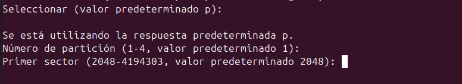

Le indicamos el tamaño de la partición y salimos


Una vez acabamos colocamos W para salir


##### Comprobacion

Colocamos fdisk -l para comprobar la lista de los discos y vemos la particion.


##### Formatear

Formateamos la particion y modificamos el tamaño del bloque

```mkfs.ext4 -b (modificacion del tamaño) (disco)```

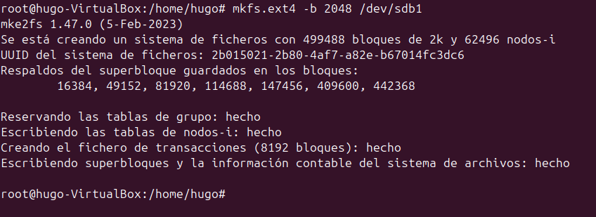

Comprobación del formateo


#### Montaje particiones

##### Temporal

Primero creamos una carpeta en /var/ y dentro le ponemos un archivo en este  caso un txt.


```mount -t (extension) (disco) (carpeta para montar la partición)```


Una vez montada la partición aparecera


Podemos comprobar que desaparece el archivo “hola” del interior de la carpeta de “particio1”, el archivo no se a perdido pero al montar una partición simplemente no aparece, podemos hacer la comprobación desmontando con ```umount /dev/sdb1```


Creamos un nuevo archivo en el interior con la particion creada


Al hacer un **“REBOOT”** se perderá la partición ya que es una partición temporal.

##### Definitiva

Modificaremos el archivo fstab situado en /etc.

```/etc/fstab/``` -> Sirve para crear particiones definitivas dentro del sistema operativo 

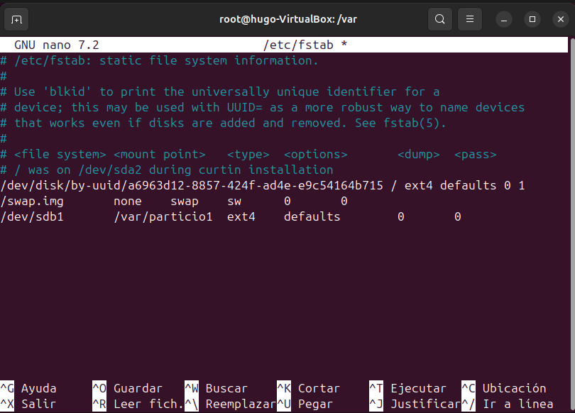

Reiniciamos la maquina y para comprobar que se a hecho correctamente la partición hacemos un ls de la carpeta donde se a creado la particion en este caso /var/particio1 y debería estar dentro el archivo “adeu” que creamos anteriormente dentro de la misma partición.


#### Compartición de carpeta

##### Nautilus

Instalamos la aplicacion nautilus


Compartimos la carpeta con la nueva opción que nos aparecerá.


Podemos comprobar que este método no funciona por lo que lo haremos con un servidor SAMBA.

##### SAMBA

Instalamos el Samba con “sudo apt install samba”


Creamos la partición en el archivo smb.conf situado en ```/etc/samba/smb.conf```

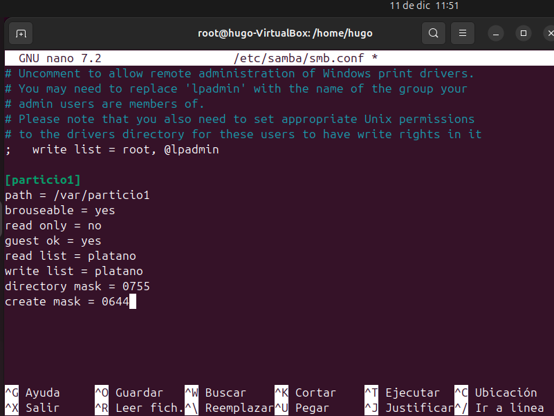

Una vez modificado tenemos que hacer un ```systemctl restart``` a ```smbd``` y ```nmbd```


Ahora cambiamos los permisos para que todos tengan permisos sobre la carpeta particio1 y le cambiamos el grupo y el ususario propietario a nobody y nogroup


Creamos el usuario platano ya que es el que colocamos al crear la particion utilizando el comando ```“adduser”```


Utilizamos el comando ```smbpasswd -a``` para cambiar la contraseña de un usuario al servidor samba

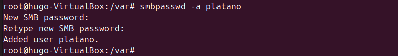

ahora en la MAQUINA CLIENTE (fuera de la maquina virtual) ponemos el comando “smbclient -L //(IP)” así podremos ver los recursos compartidos de la IP que coloquemos


Vamos a las carpetas de la MAQUINA CLIENTE y tratamos de conectarnos en la opcion de abajo a la izquierda


Ponemos las credenciales del usuario

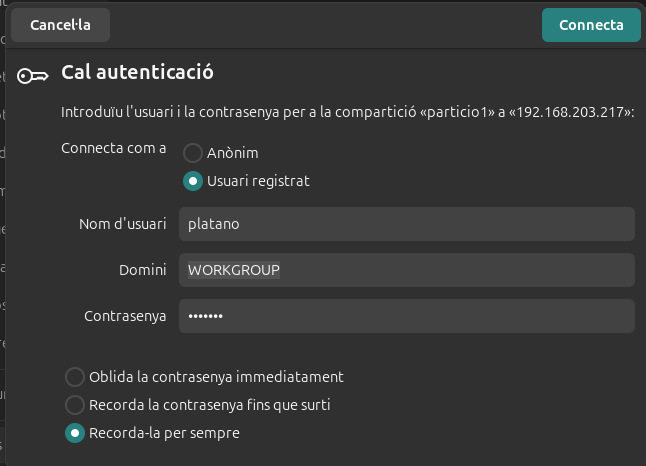

Creamos una carpeta desde la MAQUINA CLIENTE en la unidad compartida


Y la comprobamos desde la MAQUINA SERVIDOR (Máquina virtual) que está en la unidad compartida y de que la ha creado plátano.


## Quotes de disc

Identificamos el disco de 2GB que hemos creado con ```fdisk -l```


Entramos dentro del fdisk (disco) y creamos la partición

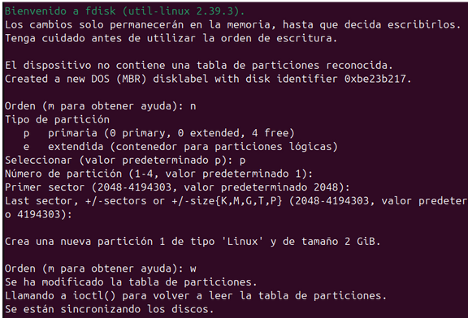

Formateamos la partición con ```mkfs.ext4``` (disco+partición)

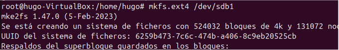

Modificamos el archivo ```/etc/fstab``` y creamos una partición definitiva y le añadimos cuotas

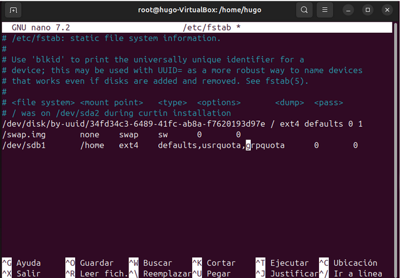


## Còpies de seguretat i automatització de tasques

Para las pruebas sera necesario crear 2 discos duros de 1 GB


### Teoria + Tabla comparativa

**Que es una copia de seguridad:** Una copia de seguridad, también conocida como backup, es una duplicación de datos que se realiza con el objetivo de protegerlos y garantizar su recuperación en caso de pérdida, daño o eliminación accidental. Estas copias permiten restaurar información valiosa, ya sea en entornos personales, empresariales o de sistemas críticos.

**Completes:**
- Duplica todos los datos seleccionados.
- *Ventaja*: Es una copia completa y fácil de restaurar.
- *Inconveniente*: Consume mucho tiempo y espacio.

**Diferenciales:**
Copia todos los cambios realizados desde la última copia completa.
*Ventaja*: Es más rápida que la completa, y la restauración es más sencilla que con incrementales.
*Inconveniente*: Ocupa más espacio que la incremental con el tiempo

**Incrementales:**
Copia solo los cambios realizados desde la última copia (completa o incremental).
*Ventaja*: Menor uso de espacio y tiempo.
*Inconveniente*: La restauración puede ser más compleja, ya que depende de varias copias.

En caso de perder información de algún back-up tendríamos que coger la última copia de seguridad completa hecha.

**Politica de copias de seguridad:** Las políticas de copias de seguridad son un conjunto de directrices, normas y procedimientos que una organización (o un individuo) establece para garantizar que los datos sean respaldados de manera consistente, segura y eficiente. Estas políticas son fundamentales para proteger la información crítica y garantizar la continuidad operativa en caso de desastres o pérdidas de datos.


### Comandos
```cp``` = Copia simple no inteligente, lo copia todo sin mirar nada. Solo se puede utilizar en local.

```rsync``` = Es una copia inteligente, solo copia los archivos modificados. También se puede utilizar entre máquinas remotas vía SSH

```dd``` = No es un comando para hacer copias de archivos, es un comando para hacer copias de discos o particiones. No es inteligente, copia todo sin mirar. También sirve para copiar de sector a sector.

#### cp

```ls /home/hugo/Documents/``` -> Comprobamos lo que hay en el interior de la carpeta


```ls /var/copies/``` -> Comprobamos el interior de la carpeta pruebas 


```cp -R /home/hugo/Documents/* /var/copies/``` -> hacemos una copia de todo el interior de  Documentos a Copias


```ls /var/copies*``` -> comprobamos el interior de copias nuevamente para comprobar que todo se a copiado bien


#### rsync

```touch /home/hugo/Documents/hhhhh``` -> Creamos un nuevo documento en el interior de la carpeta documentos

```mkdir tttt``` -> Creamos una carpeta nueva

```rm -r prova2``` -> Eliminamos prova2


```rsync -av –delete /home/hugo/Documentos/ /var/sdb1```-> Hacemos un rsync que es la copia inteligente indicando que elimine todas las carpetas que hemos eliminado en el documento


#### dd

```dd if=/dev/sdb1 of=/dev/sdc1 bs=4M status=progress```

***if=/dev/sdb1:***

- ```if``` significa "input file" (archivo de entrada).

- En este caso, ```/dev/sdb1``` es la partición o dispositivo de origen del que se copiarán los datos.

- Representa una partición en el disco físico ```/dev/sdb```.

***of=/dev/sdc1:***

- ```of``` significa "output file" (archivo de salida).

- En este caso, ```/dev/sdc1``` es la partición o dispositivo de destino donde se escribirán los datos.

- Representa una partición en el disco físico ```/dev/sdc```.

***bs=4M:***

- ```bs``` significa "block size" (tamaño de bloque).

- Define el tamaño de los bloques de datos que se copiarán de una sola vez.

- En este caso, el tamaño de bloque es de **4 megabytes (4M)**

***status=progress:***

- Este parámetro muestra el progreso del comando mientras se ejecuta.

- Sin este parámetro, el comando dd no muestra información durante el proceso, y parece que no está haciendo nada hasta que termina.


```md5sum /dev/sdb1 /dev/sdc1```


Al tener un tamaño de 4M hay riesgo de que haya un error y a lo mejor no sale el mismo hash lo que quiere decir que no se ha copiado exactamente.

Ponemos el mismo comando reduciendo el tamaño para que sea mas exacto


Volvemos a sacar los hash de ambos archivos y comprobamos que tienen exactamente el mismo.


*Esto se aclara porque en clase dio problemas a algunos compañeros pese a que a mi me funcionase bien.*

### Automatización con scripts y cron y anacron

#### Teoria
Tanto cron como anacron sirven para automatizar tareas en un sistema operativo de ubuntu, anteriormente funcionaban por separado pero ahora están integrados los 2 juntos.

**¿Cuándo utilizamos cada uno?**

Si los ordenadores pueden estar apagados mejor anacron, porque el cron solo se ejecuta cuando el ordenador está encendido en cambio el anacron cuando se tenga que ejecutar una tarea y el ordenador esté apagado cuando este se enciende comprueba si tiene alguna tarea pendiente y se ejecuta.

También utilizaremos anacron cuando sea para tareas más generales y de mantenimiento a nivel de sistema operativo, en cambio utilizaremos el cron cuando interesa más que se ejecute algo concretamente en una hora fija en una fecha determinada y para un usuario en concreto, es mejor.

Utilizaremos el archivo “```/etc/crontab```” cuando queramos ejecutar algo globalmente para todos los usuarios cuando interesa un usuario específico ejecutaremos el comando “```crontab -e -u usuario```” dentro del directorio “```/etc```” tenemos unas carpetas predeterminadas para el cron para poner scripts que queremos que se ejecuten diariamente, mensualmente, anualmente ya están preparadas

Estas son todas las carpetas que hay en etc del cron.


*PUNTO IMPORTANTE: En el anacron no funciona la variable $(whoami) por lo que tendremos que indicar el nombre del usuario*

Ejemplo de como hacer un back-up de la carpeta “/Imagenes” diariamente con un script

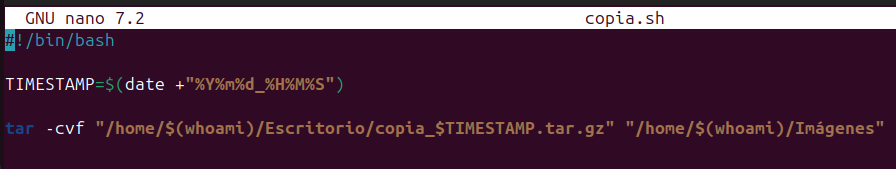

Le damos permisos al script para que pueda ejecutarse

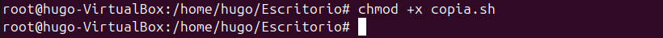

Y comprobamos que se haya generado cuando ejecutamos el script


 Este Script es muy sencillo lo unico que haces acceder a la carpeta de ```Imagenes``` comprimir el contenido de la misma y colocarle el nombre de copia junto a la marca de tiempo ```TIMESTAMP``` creada en el mismo script

 Para automatizarlo tenemos que ir al archivo ```/etc/crontab``` y colocar la siguiente línea.

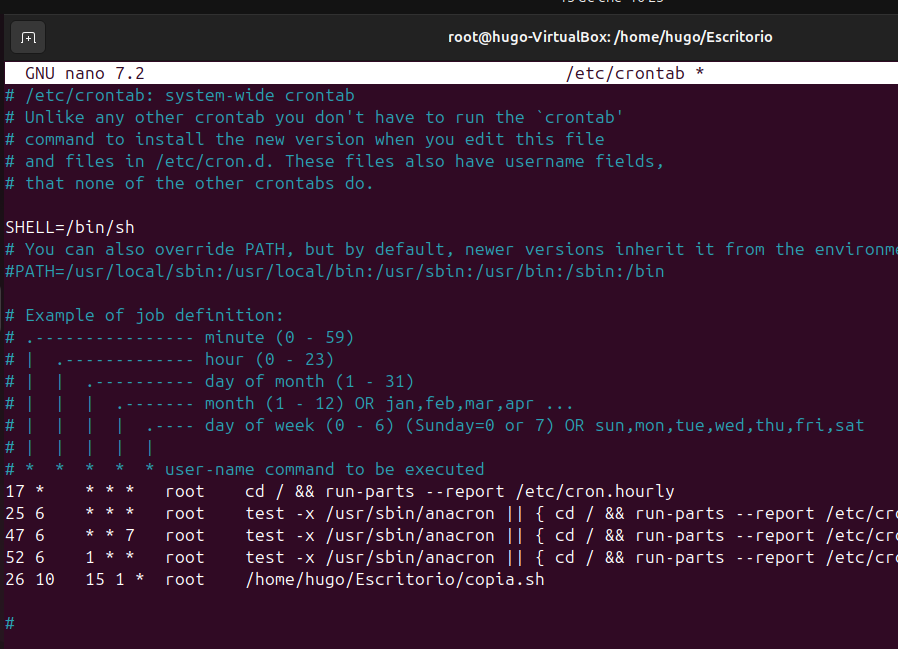

Llegada a la hora que hemos puesto en este caso del mes 15/01 a las 10:26 se tendría que haber creado una copia en el Escritorio.

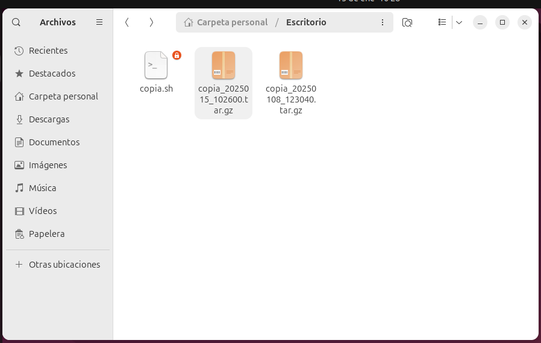

Si queremos usar el “anacron” iremos a la carpeta ```/etc/cron.daily``` y moveremos nuestro script al interior para que se ejecute cada día una vez se inicie el ordenador. !IMPORTANTE! quitar el ```.sh``` del nombre porque sino no funcionara.

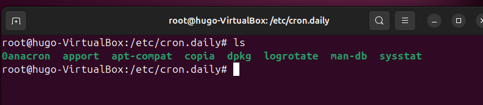

Modificamos el archivo ```/var/spool/anacron/cron.daily``` ya que en el interior de este archivo se crea una marca de tiempo la cual hará que no se ejecuten nuevamente los ```cron.daily``` hoy, borramos esta marca de tiempo para que se “crea” el ordenador que todavía no se a ejecutado hoy y tenga que hacer nuevamente sus tareas planeadas en el “/etc/cron.daily”

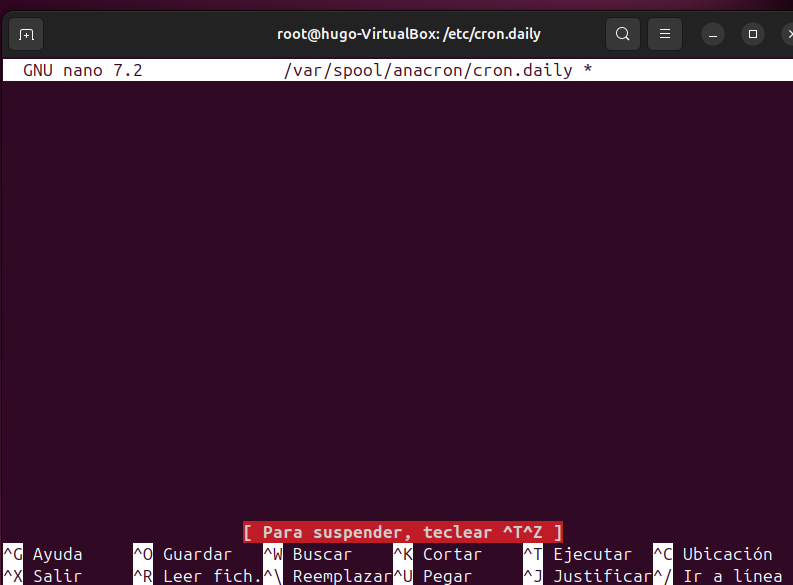

En este archivo tocamos la parte del anacron, a diferencia del cron este ejecutara los archivos aunque el ordenador esté apagado, es decir se esperará a que el ordenador se encienda nuevamente para comprobar las tareas que le faltan por hacer y las hará.

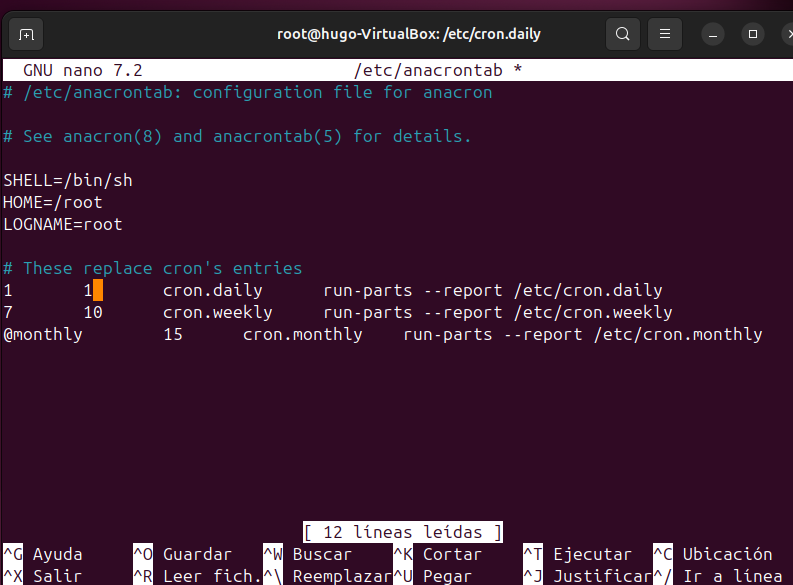

Reiniciamos el ordenador y comprobamos que se crea nuevamente una marca de tiempo y al minuto como teníamos asignado en el archivo ```/etc/anacrontab``` se ejecutara y se creará la copia de seguridad.

