# Sprint 3

## Instalacion dominio LDAP

Utilizaremos “xarxa NAT” para que nuestra IP sea fijo independientemente de mi ubicacion.

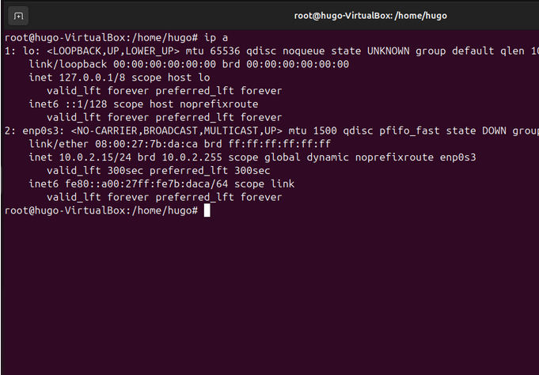

La colocamos estática para corroborar que no cambiara.


Comprobamos la IP para ver que realmente sigue todo igual


Le hacemos un ping a 8.8.8.8 para comprobar que tenemos acceso a internet.


Comprobamos el hostname de nuestro equipo con el archivo ```/etc/hostname```

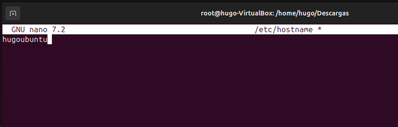

Añadimos un host nuevo para el dominio en el archivo ```/etc/hosts``` y en caso de haber modificado el hostname lo cambiamos donde salía el antiguo

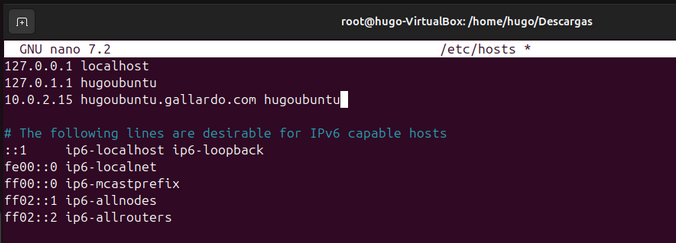

Después de este paso reiniciamos la máquina utilizando ```reboot``` para que se aplique todo correctamente.

Para comprobar que todo se a aplicado correctamente comprobamos que  sale el nuevo hostname.

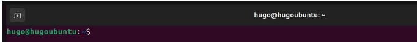

Instalamos los paquetes **slapd** (Dominio) y el paquete **ldap-utils** (comandos para modificar el dominio).

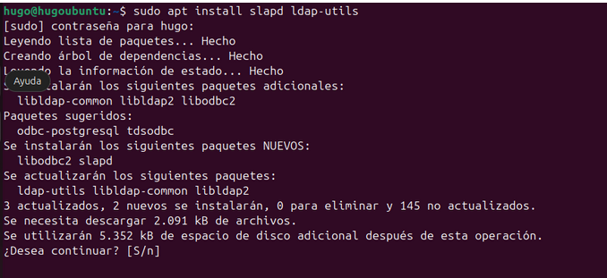


Añadimos la contraseña.

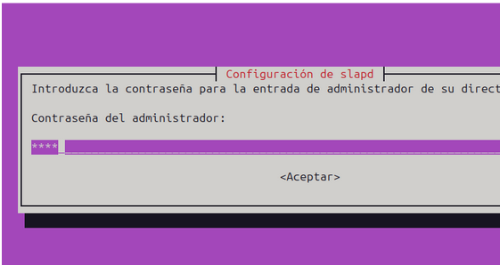

Confirmamos la contraseña nuevamente.

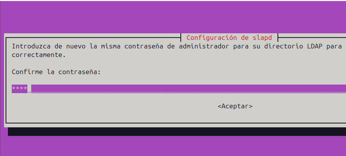

Comprobamos con el comando ```slapcat``` que se nos han creado los objetos basicos.

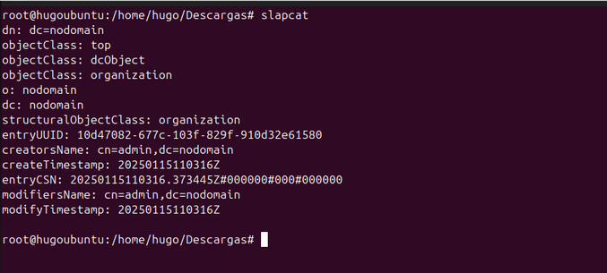

Para crear el dominio básico (esquema) con el nombre de la organización y usuario admin tenemos 2 opciones, podemos ejecutar los archivos que nos hemos descargado del moodle o podremos utilizar el comando ```dpkg-reconfigure slapd```.

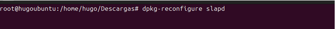

Colocaremos el nombre del dominio que tiene que ser el mismo que colocamos en ```etc/hosts```.


Colocamos el nombre  de la organización, puede ser diferente.

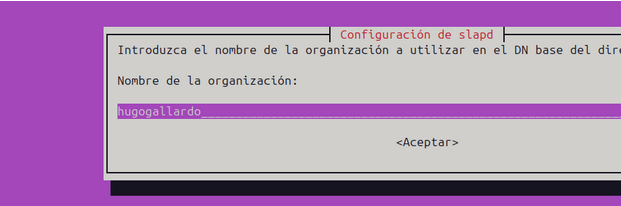

Nos pide configurar nuevamente la contraseña.

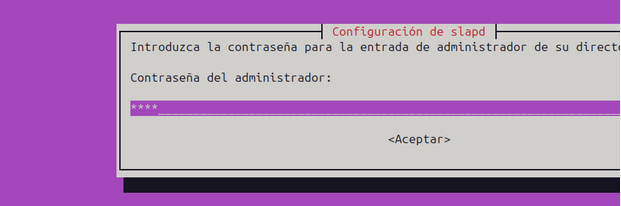

Repetimos nuevamente la contraseña.

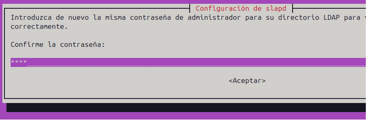

Le damos que si a las dos ultimas opciones que nos salen.


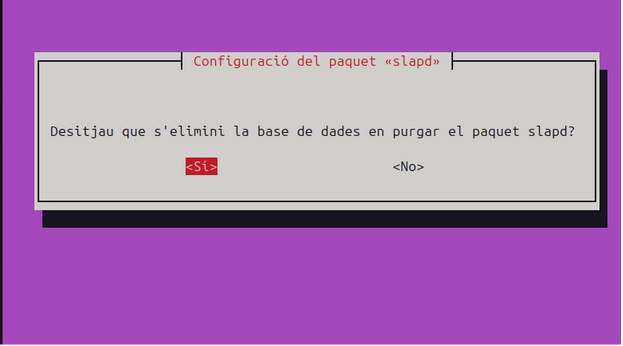

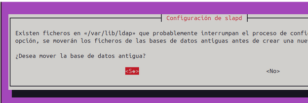

Ahora si volvemos a hacer el comando ```slapcat``` veremos que los objetos saldrán modificados con lo que hemos colocado en la anterior configuración.

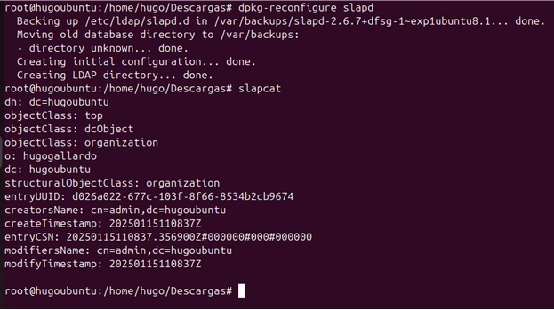

Modificamos el archivo ```uo.ldif``` que nos hemos descargado y lo configuramos con el dominio que configuramos anteriormente.

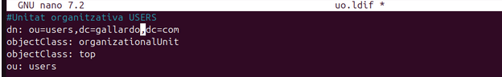

Ahora se hará lo mismo con el apartado de “grupos” en el archivo ```grup.ldif```, tambien modificamos en caso de que se haya cambiado el nombre de unidad organizativa al correspondiente y creamos el primer miembro del grupo en este caso “alu1” y en el apartado “cn=” le damos nombre al grupo que estamos creando en este caso alumnes.

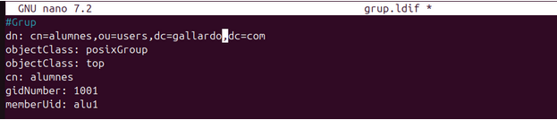

Ahora hacemos lo mismo pero con el archivo de los usuarios ```usu.ldif```, en este caso únicamente modificamos el apartado del dominio, el resto es para crear el usuario y los parámetros del mismo.

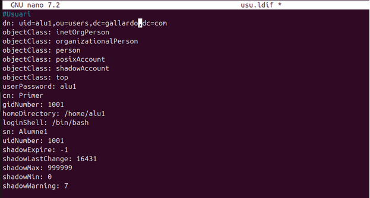

**IMPORTANTE!** El nombre de todos los archivos que se acaba de modificar no es importante, lo que es importante es que su extensión siempre sea .ldif

Aqui subimos con el comando ```ldapadd -c -x -D “cn=admin,dc=gallardo,dc=com” -W -f (archivo)``` los archivos .ldif que hemos modificado en la configuracion

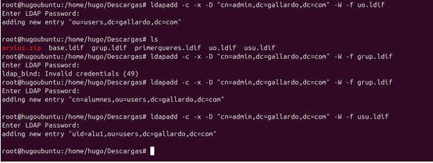

Ahora si hacemos un slapcat saldra toda la configuracion nueva subida

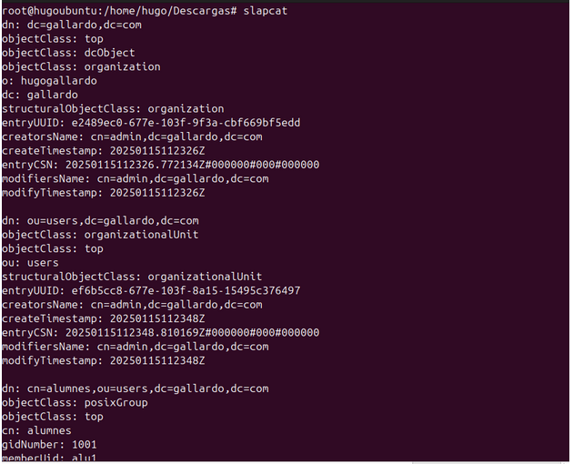


## Gestion del dominio

Comprobamos que tenemos completamente vacía la base de datos antes de comenzar con la práctica usando ```slapcat```.


Importamos la nueva base de datos del nuevo documento .ldif con el comando ```ldapadd -x -D “cn=admin,dc=gallardo,dc=com” -W -f dades.ldif```.

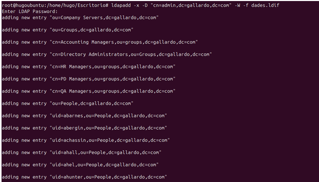

Haremos la prueba para eliminar uno de los usuarios que tenemos dentro utilizare un documento para eliminarlo, una vez el documento este creado utilizare el comando ```ldapmodify -x -D “cn=admin,dc=gallardo,dc=com” -W -f uo.ldif```.

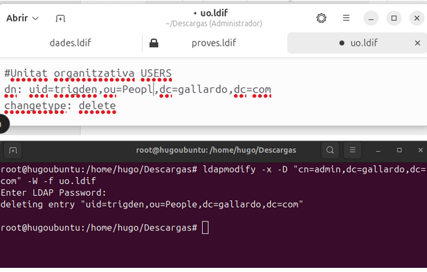

Me gusta utilizar más este método ya que te dice al 100% si se ha eliminado en el mismo comando, con el otro comando no te dice absolutamente nada y tienes que ir a comprobarlo. Pero tambien se podria utilizar ```ldapdelete -x -D “cn=admin,dc=gallardo,dc=com” -W “uid=trigden,ou=People,dc=gallardo,dc=com``` para eliminar. 

Si queremos modificar o añadir algun apartado de algun usuario que tengamos tendremos que utilizar el mismo comando de ```ldapmodify``` pero tendremos que cambiar el archivo de texto.

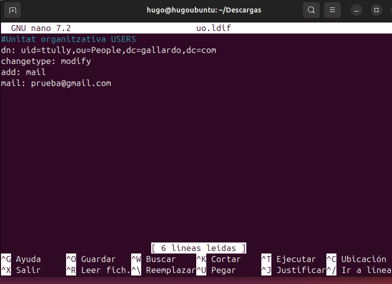

Ahora para ejecutar la modificacion tendremos que poner el comando con sudo en la terminal ```ldapmodify -x -D "cn=admin,dc=gallardo,dc=com" -W -f nombre_del_archivo```.

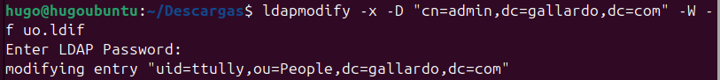

Ahora podremo eliminar tambien este mismo atributo que hemos añadido cambiando la parte final de "add" a "delete"

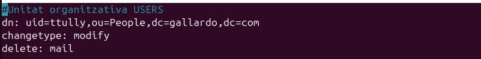

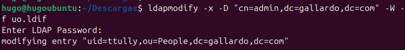

## Entornos Graficos

Empezamos buscando apache directoy en google que es lo que utilizare como entorno grafico.

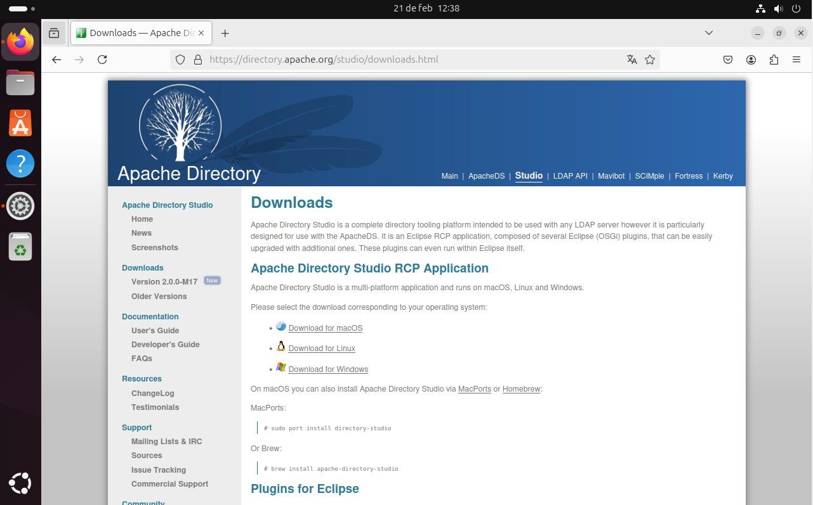

Instalamos el paquete default-jre para que nos deje ejecutar el archivo.

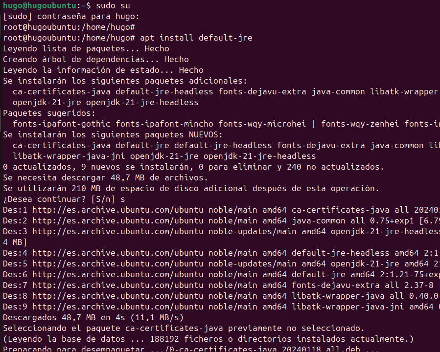

Ahora podremos ejecutar lo que hemos instalado de google

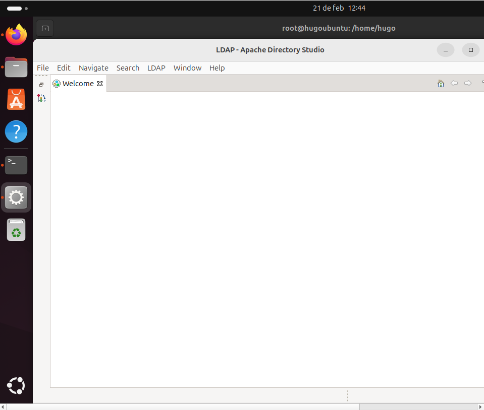

Vamos a poner una nueva conexion en LDAP Apache Directory

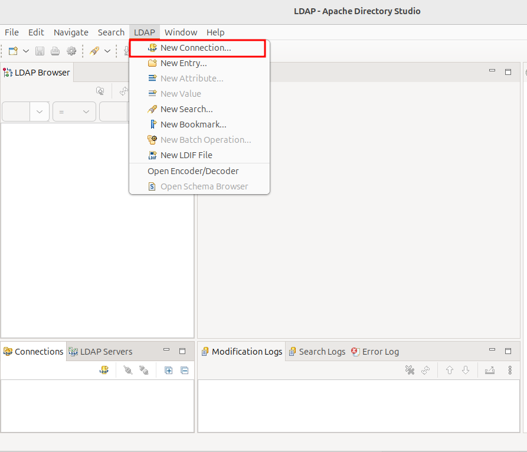

Configuramos los apartados que nos pida

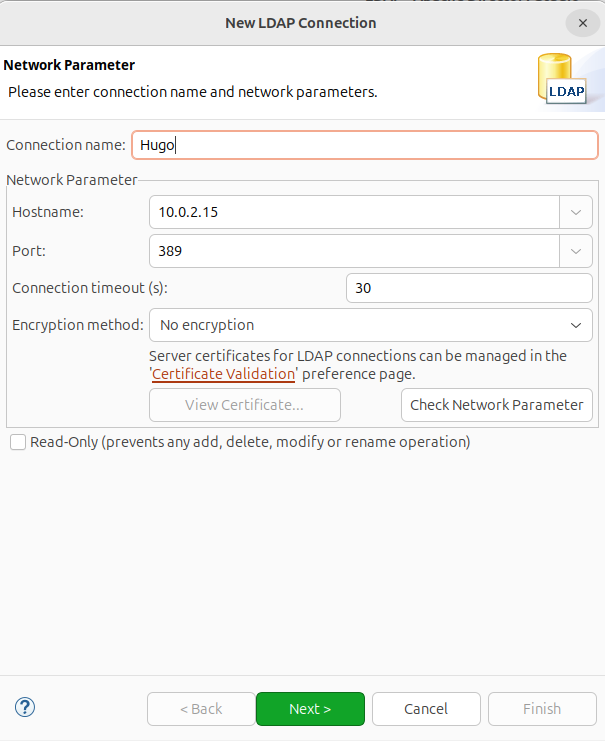

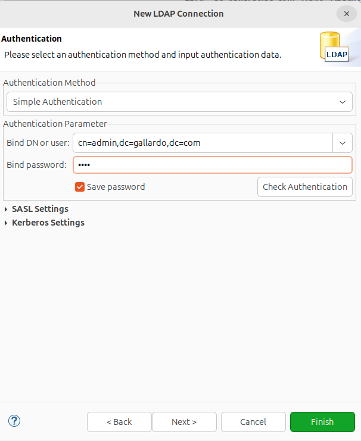

Una vez acabamos la configuracion que nos pide podremos ver como ya estamos dentro de nuestra conexion LDAP.

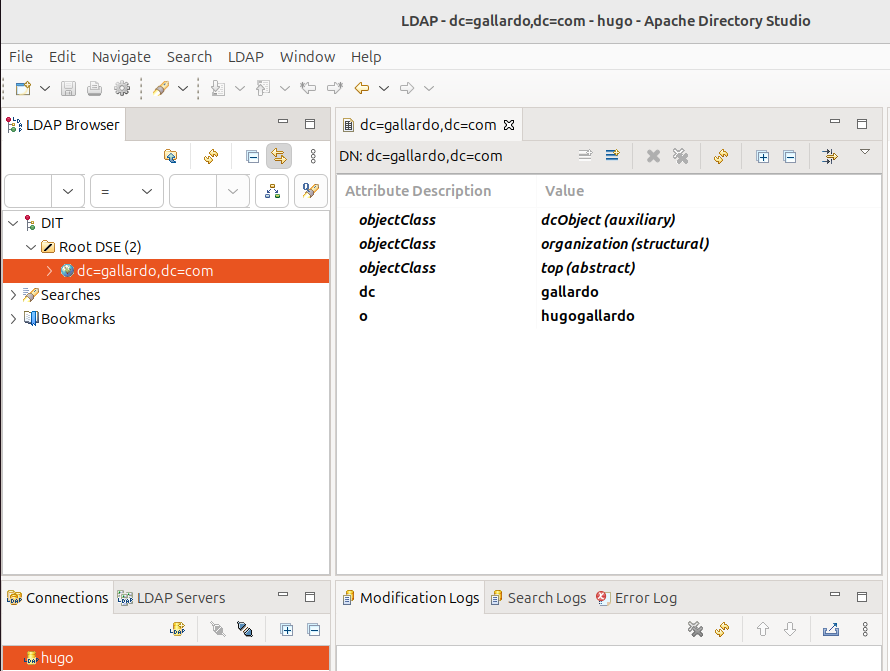

Podemos comprobar que si abrimos los desplegables saldran los usuarios que tenemos nosotros ya creados etc...

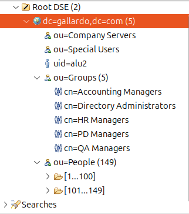

Vamos a crear un nuevo usuario para poder comprobar que funciona todo coorectamente asi que le daremos click derecho a la barra de la izquierda y seleccionaremos New Entry

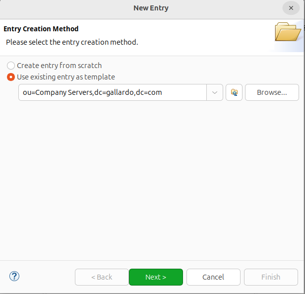

Añadimos un nuevo usuario

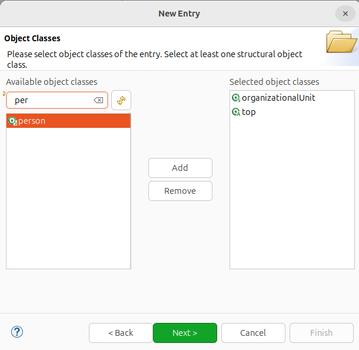

Comenzamos a llenar la configuracion del usuario

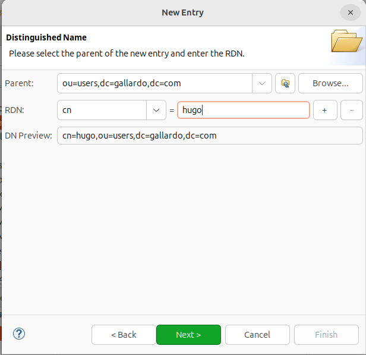

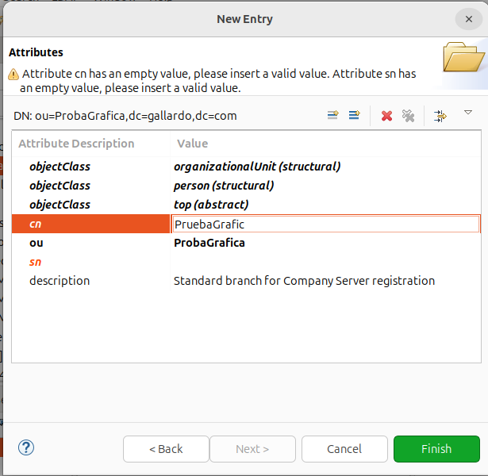
## Unir equipos al dominio

### Comprobaciones Previas:

Tenemos que comprobar que están en la misma red tanto cliente como servidor ya que sino todo lo que hagamos no servirá de absolutamente nada.

Hacemos un “ip a” para comprobar la IP de la maquina cliente y comprobamos que este en el mismo rango que el servidor.

**IP CLIENTE**


**IP SERVIDOR**


En mi caso la IP se duplica, cosa que no iba a funcionar, para solucionarlo la he puesto de manera manual en el cliente.

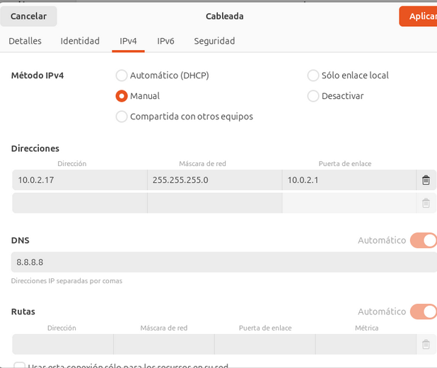

Una vez las tengamos correctas comprobamos con un PING de cliente -> servidor y de servidor -> cliente para ver que si tenemos conectividad

**CLIENTE -> SERVIDOR**


**SERVIDOR -> CLIENTE**


Tendremos que instalar estos 3 paquetes (libnss-ldap | libpam-ldap | nscd)

En primer paso haremos un ```apt update``` para actualizar repositorios, después utilizaremos el comando ```apt install libnss-ldap libpam-ldap nscd```

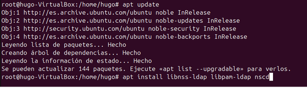

Comenzará un asistente para instalar los paquetes que acabamos de mencionar, tendremos que darle al ESC ignorando la configuración inicial y colocaremos el comando ```dpkg-reconfigure ldap-auth-config``` para comenzar con la instalación desde 0 ya que haciendolo asi nos saldran mas opciones que de manera default.

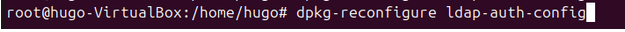

Le damos a que si ya que queremos reconfigurarlo todo desde cero 

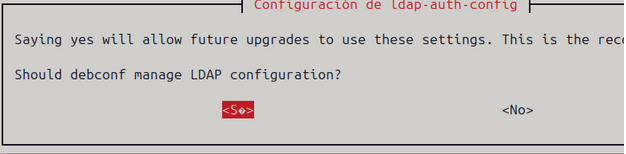

En este primer paso tendremos que corregir lo que sale predeterminado ```ldapi:///``` y tendremos que colocar lo siguiente ```ldap://IP_Server```.

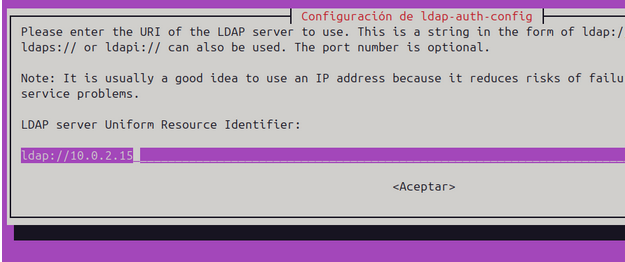

Cambiamos las opciones del dominio y colocamos en el servidor

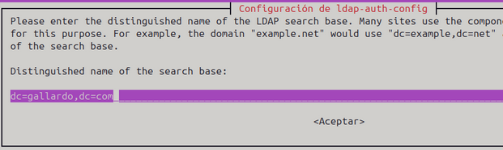

Escogemos la version nº3

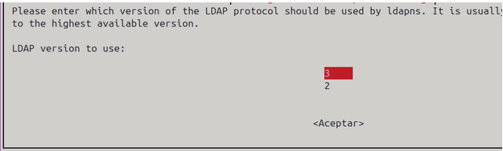

Le damos a que SI a las dos siguientes opciones

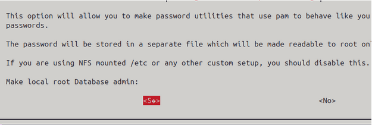

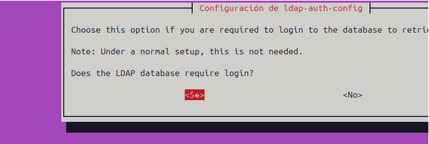

Colocamos mas configuraciones que ya se hizo previamente en el dominio del servidor del usuario con privilegios

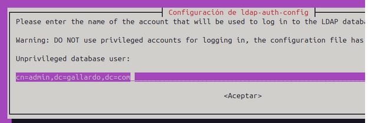

Elegimos el sistema de encriptación MD5

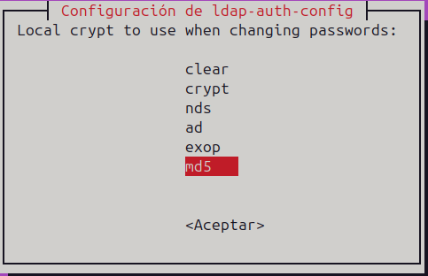

Modificamos este archivo para que cuando vaya a buscar un archivo no pase por los archivos ya que esta en el servidor.

**ANTES:**

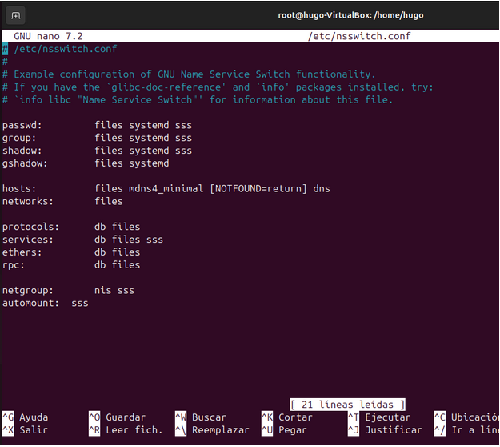

**DESPUES:**

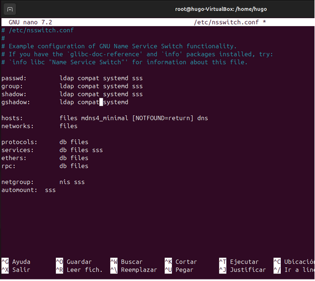


## Servidor SAMBA

### Introduccion SAMBA

**¿Qué es SAMBA?**

Samba es una implementación libre del protocolo de archivos compartidos de Microsoft Windows (SMB/CIFS) para sistemas Unix y Linux. Permite que los sistemas Unix y Linux actúen como servidores de archivos e impresoras en redes mixtas, facilitando la interoperabilidad entre sistemas operativos diferentes. Con Samba, los usuarios pueden compartir archivos, impresoras y otros recursos en una red de manera transparente, como si estuvieran utilizando un servidor Windows.

### Instalacion y configuracion Server

Para comenzar con la instalación de samba instalaremos el paquete principal “samba” con el comando ```apt install samba```

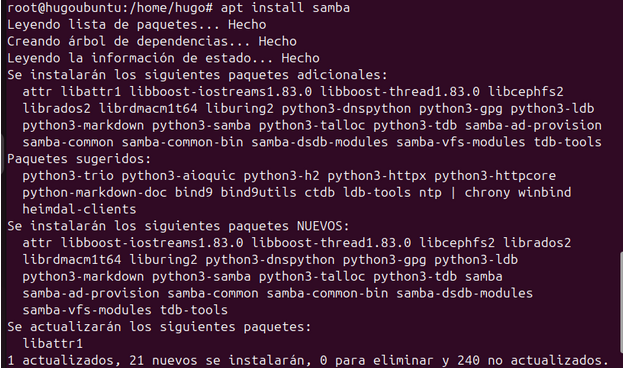

Para iniciar con la prueba de que el servidor vaya a funcionar correctamente para compartir una carpeta tendremos que crear la carpeta en este caso “proves”, cambiaremos los permisos de esa carpeta con ```chmod -R 777 proves``` y le cambiaremos el propietario con ```chown nobody:nogroup```, también en el interior crearemos un archivo de texto llamado hola.

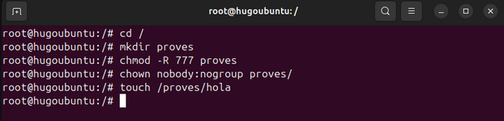

Uno de los archivos a tener en cuenta que de momento no tocaremos pero se tiene que saber es el archivo ```smb.conf``` situado en la carpeta ```/etc/samba/smb.conf```, en este caso lo único que añadiremos es un nuevo repositorio compartido.

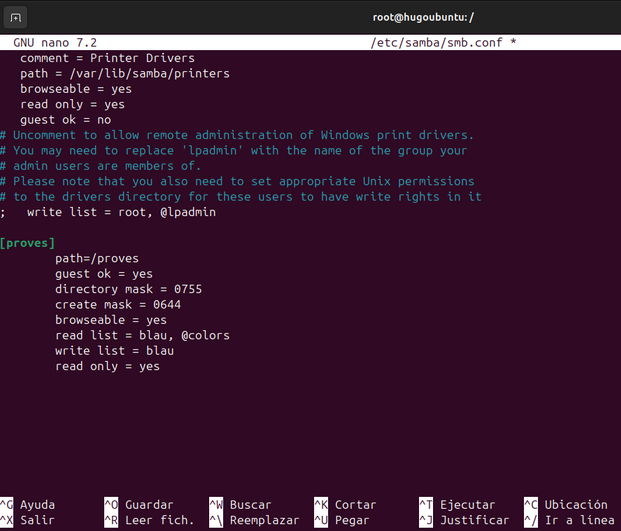

**¿Que se puede hacer con smb.conf?**

El archivo ```smb.conf``` es la configuración principal de Samba, y controla cómo se comporta el servidor SMB. Se encuentra normalmente en ```/etc/samba/smb.conf``` (en Linux) y permite definir qué carpetas se comparten, qué permisos tienen los usuarios, la autenticación y otras opciones avanzadas.

Ahora reiniciamos los dos servicios para que se apliquen correctamente los cambios

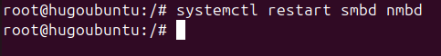

Ahora crearemos usuarios para que puedan acceder al servidor samba pero que no sean logeables en el equipo. Crearemos también el usuario Roig y Groc para poder hacer pruebas añadiendoles al grupo colors.


También crearemos el grup “colors” y añadiremos a Roig y Groc

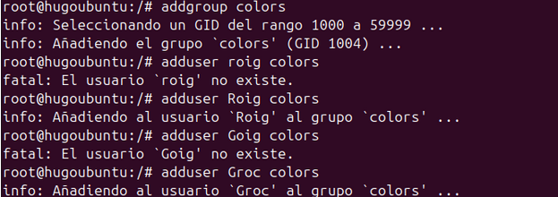

Hacemos la comprobación para que se corrobore que está todo creado correctamente.

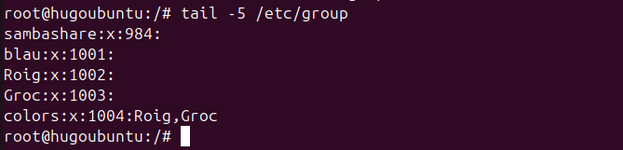

Ahora le añadimos una contraseña a los usuarios en samba para poder usarlos. De esta manera los añadimos al servicio de SAMBA

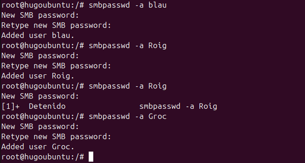

### Instalación y pruebas cliente

Para empezar a trabajar con el ciente instalamos el paquete "smbclient" con el comando ```apt install smbclient```

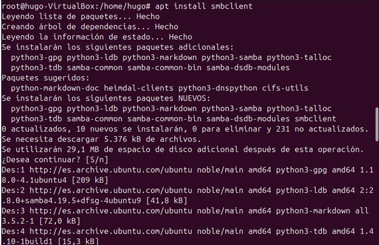

Para poder conectarse abrimos una pestaña de archivos -> Otras ubicaciones y añadimos “smb://IP/Repositorio”

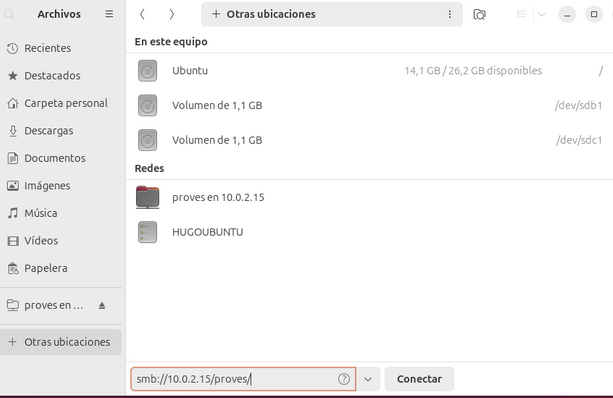

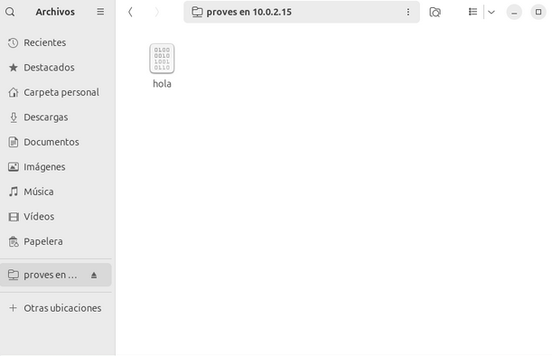

Al conectarnos como anonimo no nos tendria que dejar escribir, vamos a hacer la comprobacion.

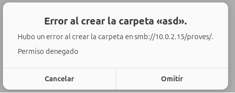

No nos ha dejado así que haremos otra prueba cambiando los parámetros del servidor

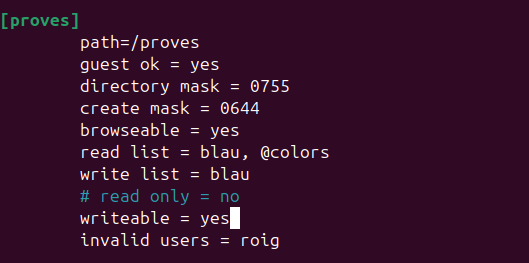

Reiniciamos los servicios para que se apliquen los cambios.

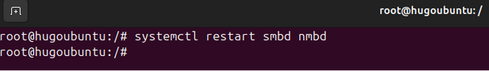

Ahora si nos dejara crear carpetas en el interior de la carpeta de samba desde el cliente.

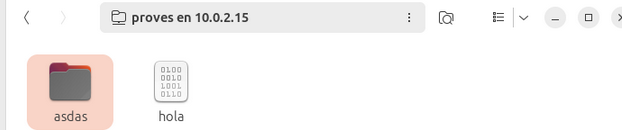

Comprobamos desde el servidor que se vea el interior de la carpeta samba actualizado

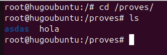

Ahora haremos la misma prueba pero entrando con un usuario

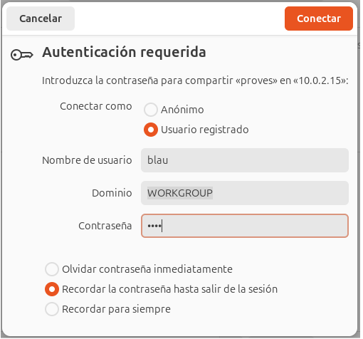

Comprobamos que tiene permisos como indicamos en los parámetros de smb.conf

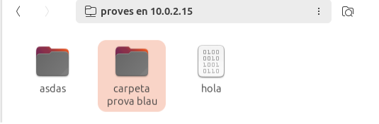

Y comprobamos quién es el propietario de la carpeta desde el servidor.

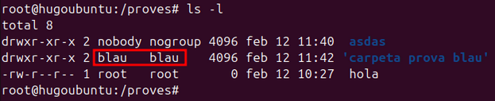

Ahora haremos la misma comprobación desde uno de los usuarios que no tiene permisos.

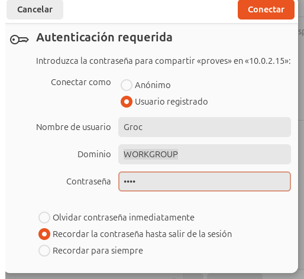

Comprobamos que no se puede crear una carpeta porque no tiene permisos.


Ahora haremos la misma comprobación con el usuario Roig y en teoría no nos tendría que dejar ni entrar.

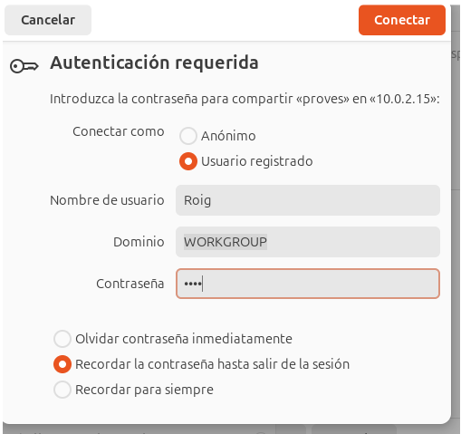

Ahora nos devolvera al apartado de usuario porque no funcionara


## Servidor NFS

**¿Que es NFS?**
NFS (Network File System) es un protocolo de sistema de archivos distribuido que permite a los dispositivos compartir archivos y directorios a través de una red, como si estuvieran en el mismo sistema. Fue desarrollado por Sun Microsystems en los años 80 y es ampliamente utilizado en entornos UNIX y Linux.

**¿En que es diferente de SAMBA?**
Samba y NFS tienen un propósito similar (compartir archivos en red), pero difieren en su funcionamiento y compatibilidad:

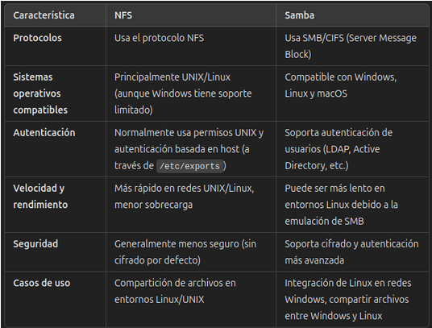

### Instalación parte servidor

Hacemos un apt update para que se actualicen todos los directorios para instalar los programas con la ultima version:

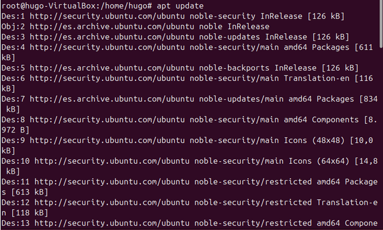

Instalamos el paquete del NFS:

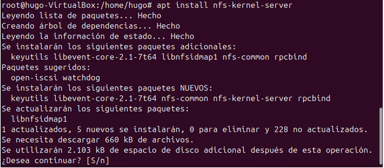

Comprobamos el status del nfs para comprobar que se a instalado correctamente con el comando ```systemctl status nfs-server```

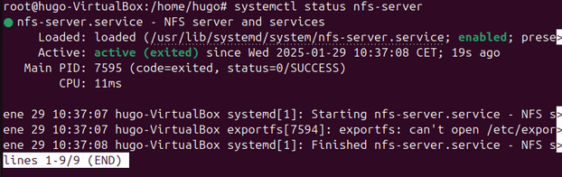

Una vez hecho esto el servidor ya está preparado para utilizar el servicio nfs

### Instalación parte cliente ubuntu

Hacemos un update para actualizar los repositorios nuevamente

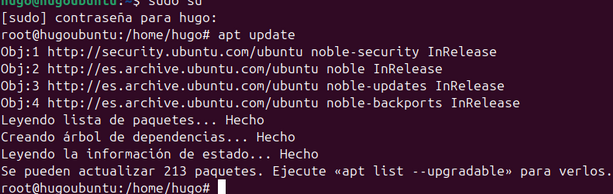

Instalamos el nfs-common y rpcbind con el comando ```apt install nfs-common rpcbind```


### Instalación parte cliente windows

Para la parte de Windows abrimos el panel de control

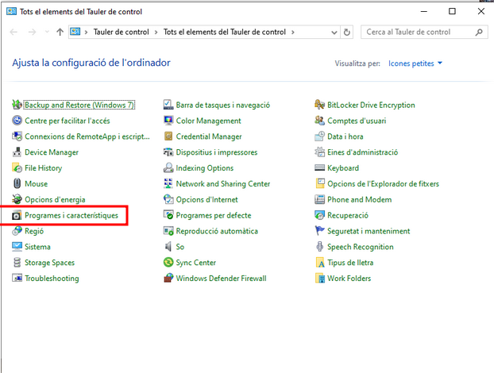

Le damos a la opcion de **Programes y caracteristiques**

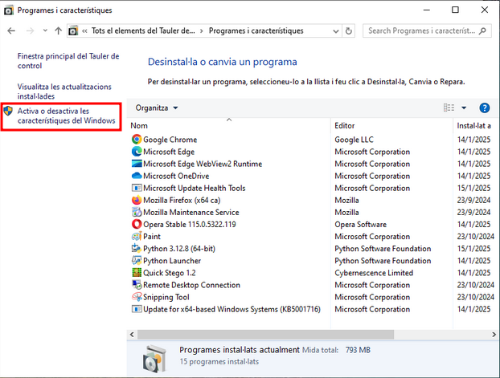

Y en la parte de la izquierda le damos a la opción de “Activa o desactiva les caractéristiques de windows”, en esta opción buscamos la opción de Servicio NFS y activamos ambas opciones expandiendo la carpeta.

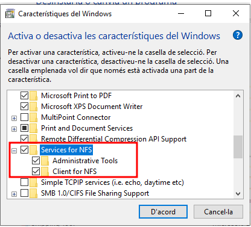

### Compartición carpeta al server y pruebas 

Creamos la carpeta que vayamos a compartir

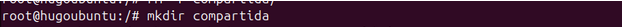

Le quitamos de ningún grupo a la carpeta y le añadimos permisos a todos los usuarios

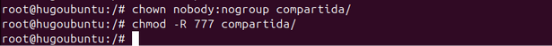

Para compartir la carpeta tendremos que ir al documento ```/etc/exports``` y añadir la siguiente linea:

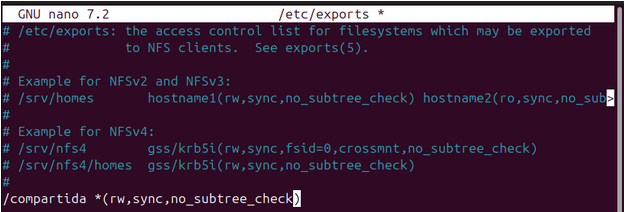

Para que funcione correctamente reiniciamos el servicio:

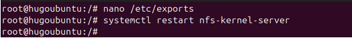

Ahora creamos un fichero de texto dentro de la carpeta para comprobar que se ve en los clientes y verdaderamente se ha compartido.

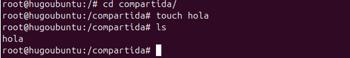

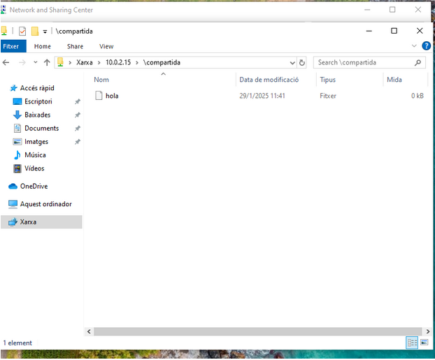

Para comprobar los permisos del cliente Windows probamos a crear algo.

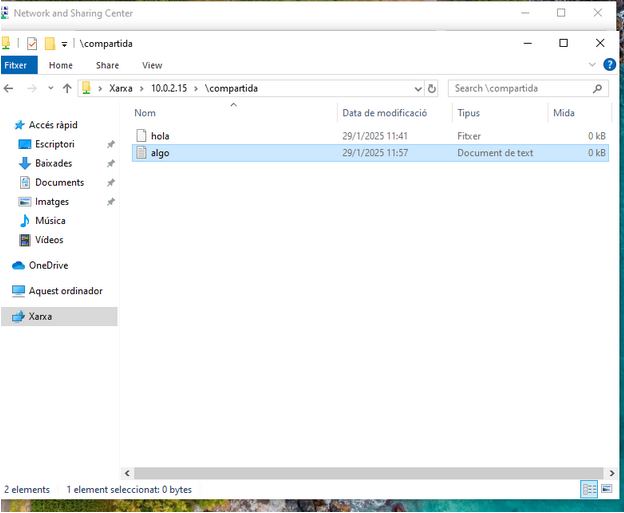

Ahora vamos al servidor para comprobar que se a creado correctamente y miramos el usuario.

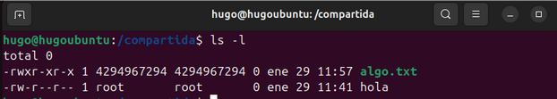

Creamos una carpeta en /mnt llamada nfs que es donde montaremos el punto de montaje con ```mkdir nfs```.

Creamos un punto de montaje de la carpeta compartida en el cliente de ubuntu.

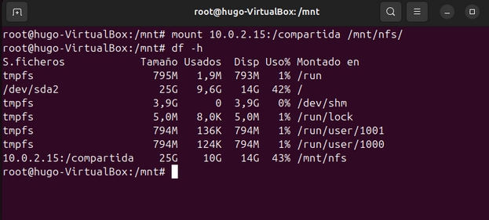

Creamos y comprobamos el interior de la carpeta para ver que realmente si que funciona

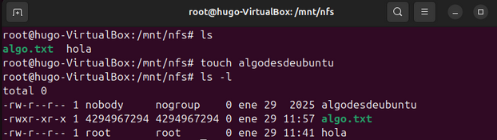

Lo comprobamos desde el servidor

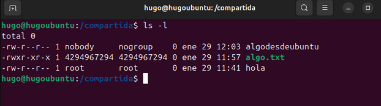

## Perfil Movil (Ubuntu LDAP)

**¿Que es un Perfil Movil?**

Un perfil móvil es un tipo de perfil de usuario que se almacena en un servidor central y se carga en cualquier equipo al que el usuario inicie sesión. Esto permite que los usuarios tengan un entorno de trabajo consistente y sus configuraciones personales disponibles en cualquier equipo de la red.

Creamos en la raiz ```/``` la carpeta perfils con ```mkdir perfils```


Al ser una carpeta compartida para tener los perfiles en cualquier ordenador tendremos que modificar ```/etc/exports``` para compartirla.

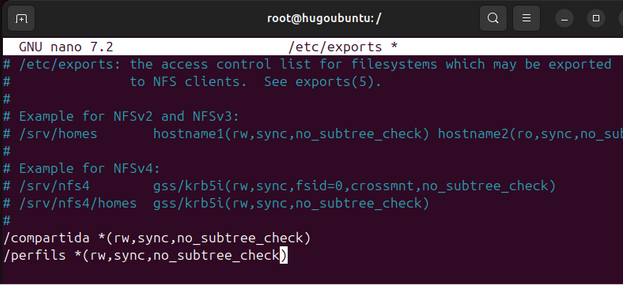

Reiniciamos el servicio nuevamente para que funcione correctamente 

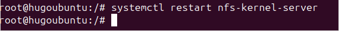

Cuando vayamos a crear el nuevo usuario dentro del servidor tendremos que modificar el Home Directory para que su home este compartida en todos los pc’s

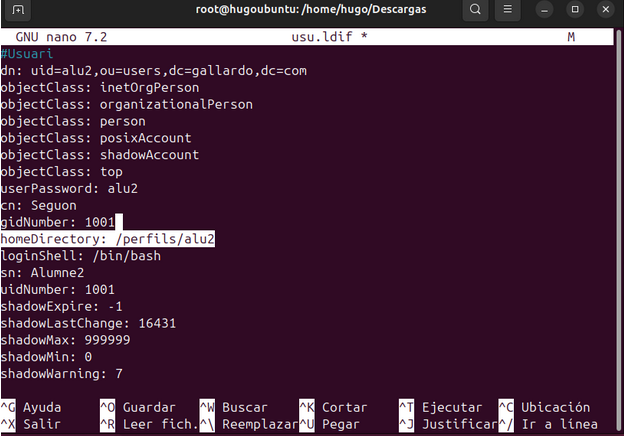

Creamos el nuevo usuario

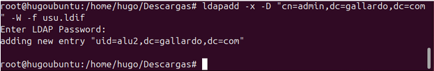

En la carpeta de clientes creamos la carpeta de perils


Para que no se pierdan los mount crearemos una compartición en el archivo “/etc/fstab” del cliente ubuntu para mantener siempre los usuarios.

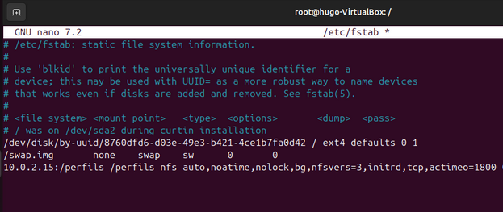

Ahora reiniciamos la máquina y comprobamos que podamos acceder con el usuario alu2

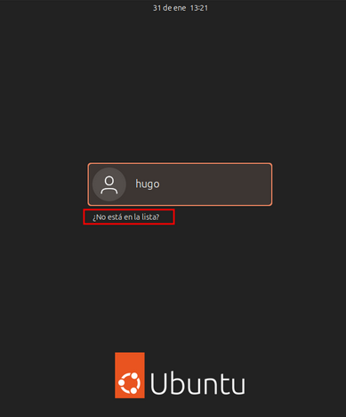


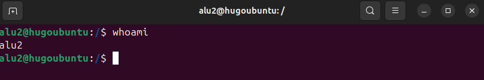