# Sprint 5

## Monitorización y rendimiento

Podemos monitorizar y ver el rendimeinto de nuestro ordenador por herramientas graficas como por ejemplo Monitor del Sistema


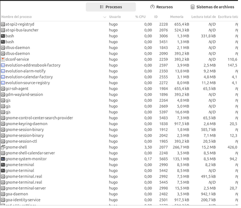

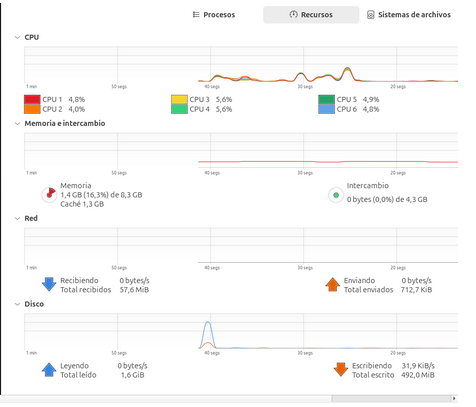

Tambien tenemos un apartado importante que son los Log’s.

¿Que es un Log?

Un log es un archivo que registra eventos que ocurren en un sistema operativo o software. Estos registros son útiles para diagnosticar problemas, realizar auditorías y monitorear el rendimiento del sistema.

En Ubuntu tenemos mucha cantidad de Log’s y se encuentran en ```/var/log```

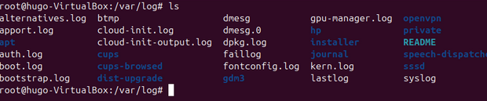

Podemos ver la configuración de estos logs en el documento ```/etc/logrotate.conf```

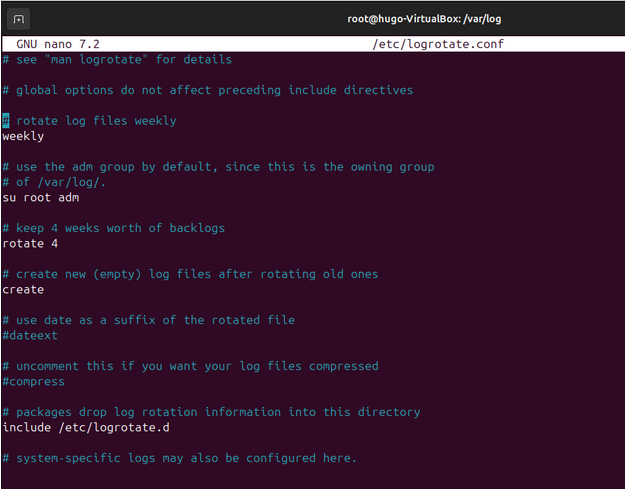

También está el ```/etc/logrotate.d``` que sirve para personalizar en especifico una a una de las configuraciones de los logs.

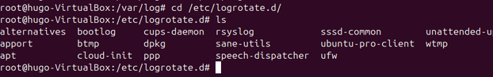

En el archivo ```/etc/rsyslog.d/50-default.conf``` servirá para indicar los logs que queremos que se guarden y donde queremos que se guarden.


Haremos las pruebas teniendo 2 terminales abiertas, una teniendo un tail de syslog para ver lo que pasa en todo momento.


Y en otra terminal iremos haciendo las pruebas como por ejemplo de mail

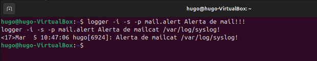

Podemos comprobar que sale en el tail


Y comprobamos que tambien se han hecho en el documento de la configuración

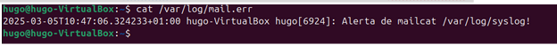

Editamos la configuracion de esta manera y volvemos a hacer la misma prueba.

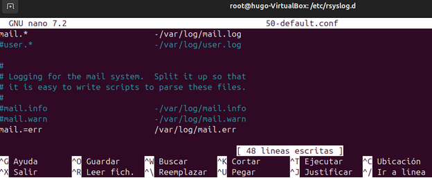

Ahora volvems a hacer la misma prueba de la misma manera y comprobamos que solo nos sale esa alerta. 

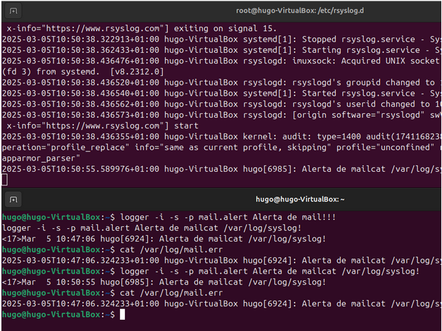

Ahora hacemos un nuevo log en 50-default.conf para dividir los que mas nos interesan en un archivo nuevo.

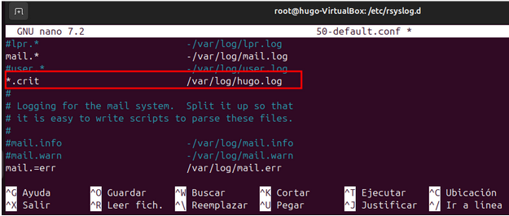

Reiniciamos el servicio

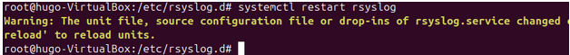

Le hacemos la prueba poniendo una de las terminales con el tail de syslog para comprobar que salta el error, y en la otra terminal hacemos un logger para que salte un error critico.

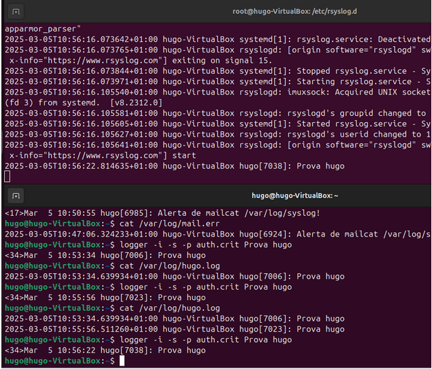

Y comprobamos que vaya al archivo que le hemos indicado.

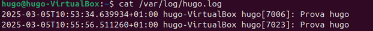

Para que nos salgan en el tail de syslog esta clase de errores tenemos que modificar esta linea del 50-default.conf y dejarla unicamente con “ * ”


Tenemos también comandos para ver los avisos que han saltado en el servicio por ejemplo para ver los críticos. Utilizaremos “journalctl”

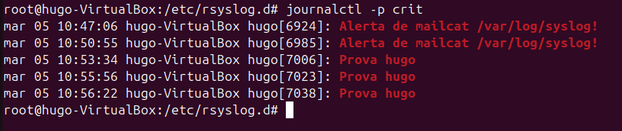

Journalctl tambien puede filtrar alertas de los usuarios, podemos de un usuario en concreto utilizando el “UID” del usuario

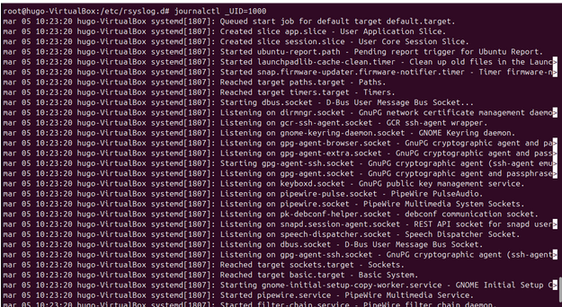

O para ver usuarios en general se hara con –user

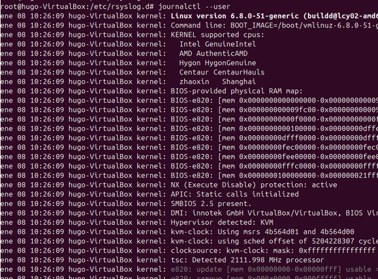

journalctl entre fechas:

#### 1. Filtrar entre dos fechas específicas

```journalctl --since "2025-03-10 12:00:00" --until "2025-03-12 18:30:00"```


#### 2. Filtrar desde una fecha en adelante

```journalctl --since "2025-03-10"```


#### 3. Filtrar hasta una fecha específica

```journalctl --until "2025-03-12"```

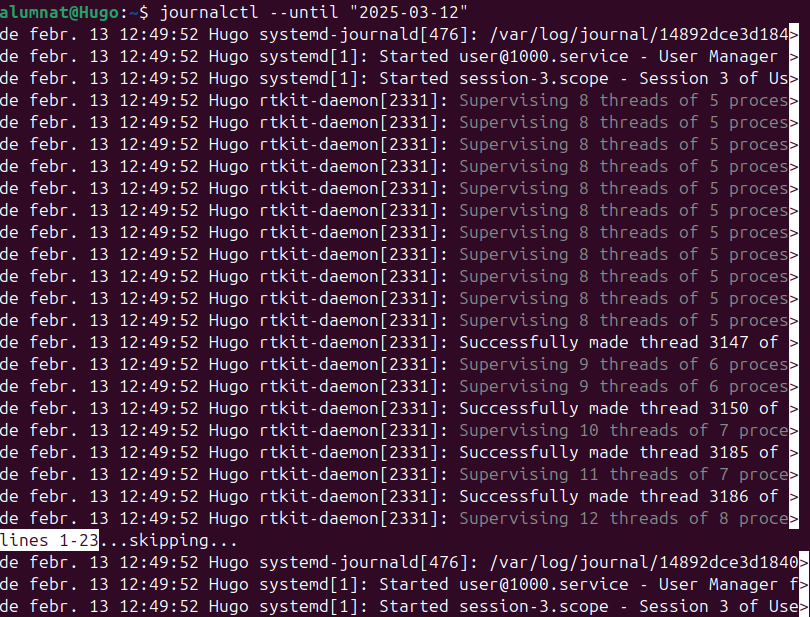

#### 4. Filtrar usando tiempos relativos

```journalctl --since "1 day ago"```


## Auditorias

**¿Que es Lynis?**

Lynis es un escáner de seguridad de código abierto que se usa para:
Evaluar la seguridad del sistema.


Detectar configuraciones débiles o incorrectas.


Recomendar mejoras para proteger mejor un servidor o equipo Linux.


Fue diseñado para administradores de sistemas, auditores y profesionales de seguridad.

Instalamos Lynis ejecutando el siguiente comando


Y con un simple comando como es ```lynis audit system``` podriamos tener toda la informacion de la maquina.

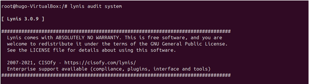

Podemos ver diferentes parametros del sistema

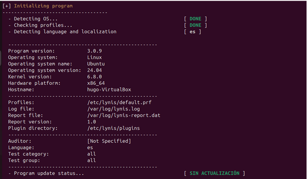

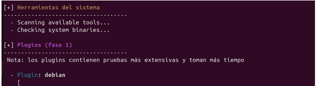

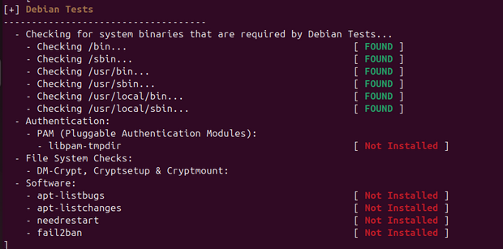

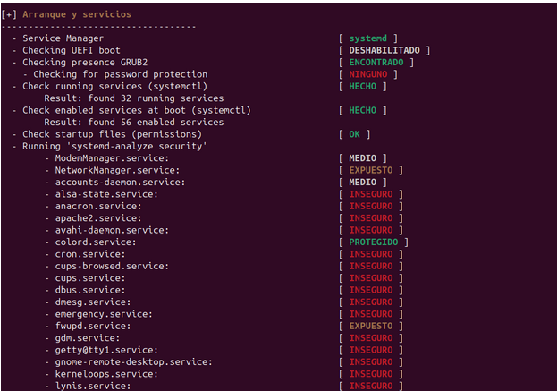

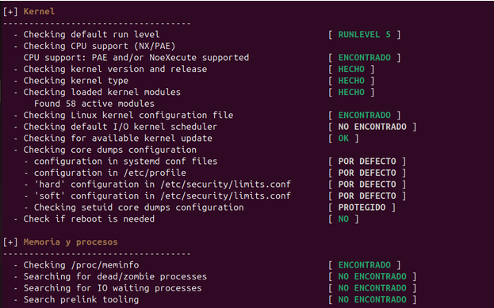

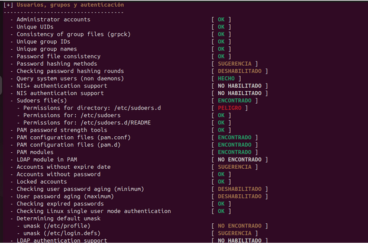

Tambien hay opciones para hacerlo de manera mas estructurada y que no nos salga toda la informacion directamente, sino que podemos filtrar por categorias con el comadando. ```lynis audit system --tests-from-category "kernel"```, de esta manera nos saldra unicamente la informacion necesaria del equipo y la categoria que nosotros hemos especificado


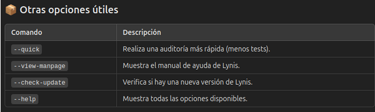


## Servidor de actualizaciones

**¿Que es?**

Un servidor de actualizaciones es un sistema que gestiona y distribuye actualizaciones de software a otros equipos en una red.

**¿Para qué sirve?**

Sirve para centralizar la gestión de actualizaciones, asegurando que todos los equipos de la red reciban las actualizaciones necesarias de manera eficiente y oportuna, mejorando la seguridad y el rendimiento del sistema.

Instalaremos el paquete Apache2 para poder comenzar con el servidor.


También descargamos el paquete apt-mirror


Abriremos el archivo ```/etc/apt/mirror.list``` para indicar el repositorio que se tendran que bajar los clientes, comentaremos todas las lineas para que no se descarguen los GB innecesarios que no queremos ahora mismo y añadiremos nuestra propia linea con lo que queremos que se descargue

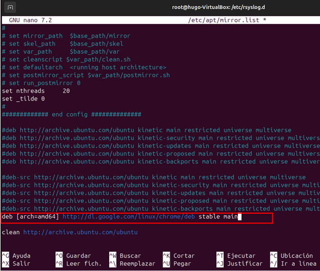

Para descargar el repositorio en nuestro equipo colocamos la comanda ```apt-mirror```

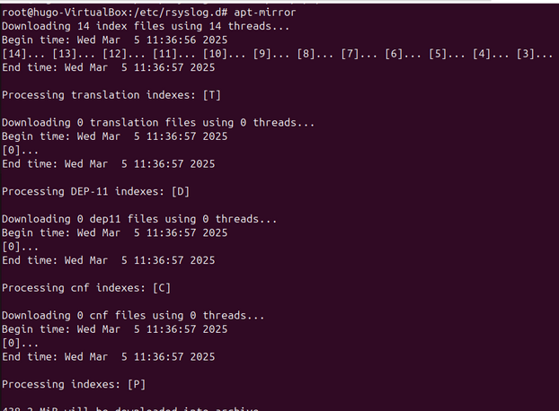

Creamos un soft-link y comprobamos el interior de la carpeta indicada.

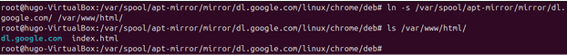

En el cliente modificamos este archivo para que coga el repositorio del servidor 

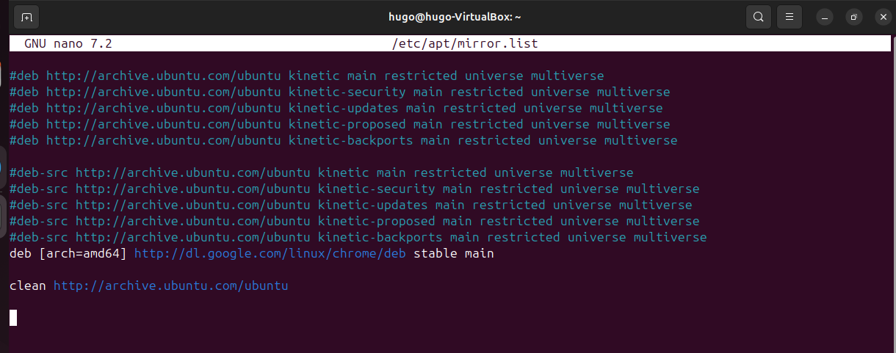

Ejecutamos el sigueinte comando

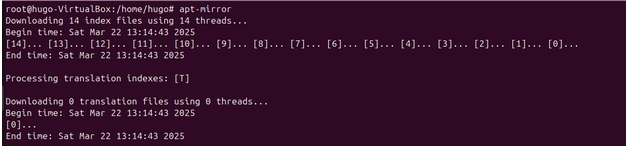

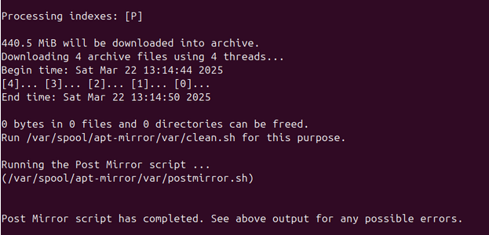

Creamos un soft link entre donde hemos añadido el repositorio de chrome al servidor apache que hemos instalado.

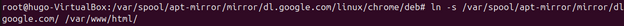

Ahora en el CLIENTE

Firmamos con google chrome

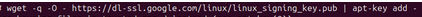

Añadimos el repositorio de Google Chrome pero esta vez desde nuestro servidor.
En el directorio ```/etc/apt/``` editamos el fichero ```sources.list``` y añadimos el servidor y el paquete.

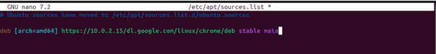

Ahora al hacer un apt update deberia salirnos el servidor con el repositorio de Google Chrome.


